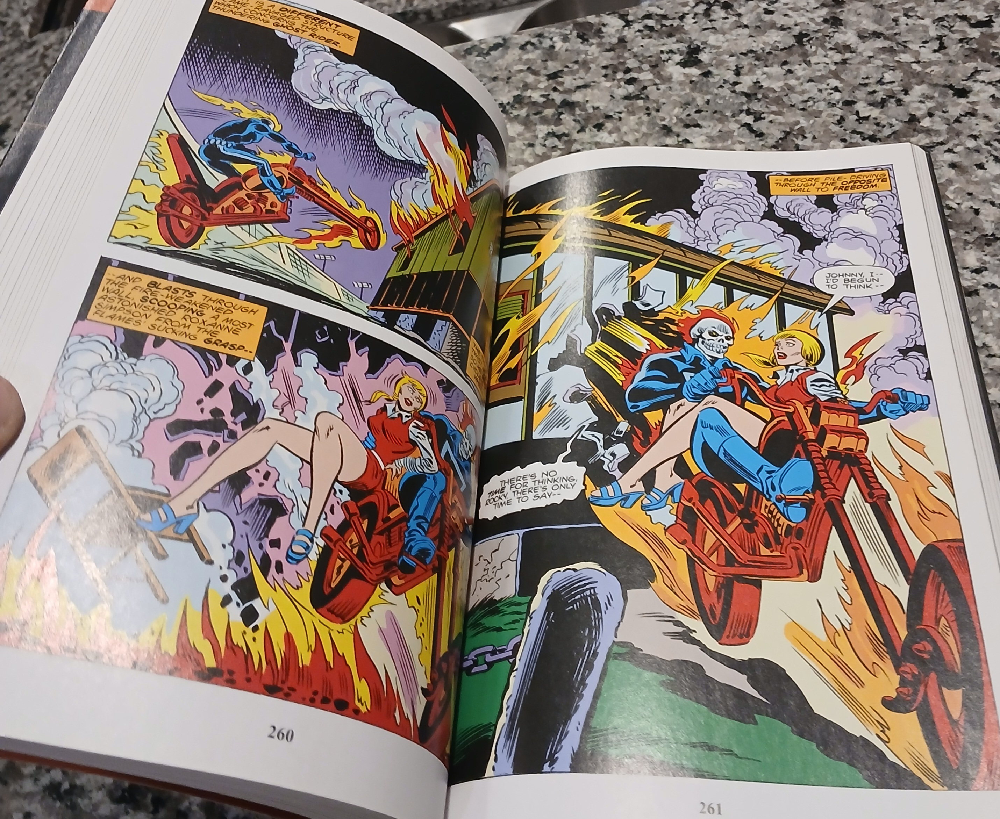
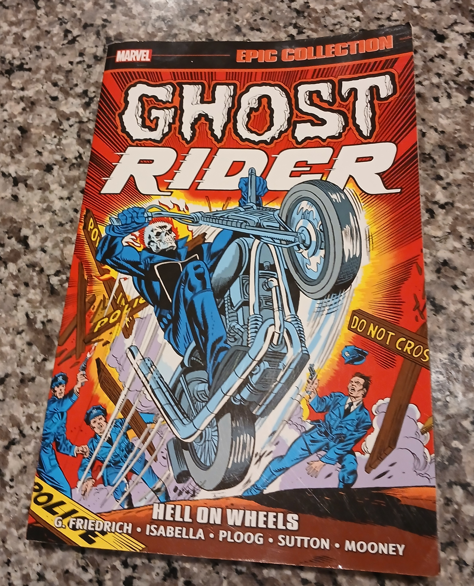

---

title: "A Look at Ghost Rider Epic Collection Vol. 1"
date: "2026-06-09"

layout: ../../layouts/PostLayout.astro
description: "Revisiting the origins of the Spirit of Vengeance in the first Ghost Rider Epic Collection."

img_path : "/ghost_rider_epic.jpg"
img_alt: "Ghost Rider Epic Collection Cover"

tags: ["#Review"]

---

## Burning Rubber

Let's talk comics! Specifically, let's talk [Ghost Rider.](https://en.wikipedia.org/wiki/Ghost_Rider_(Johnny_Blaze))

I’ve been working through the [Ghost Rider Epic Collection Vol. 1: Hell on Wheels](https://marvel.fandom.com/wiki/Epic_Collection:_Ghost_Rider_Vol_1_1) and it’s a masterclass in establishing a character through unadulterated atmosphere.

I have always had a love for old comics, especially any comic in which the incredible late [Stan Lee](https://en.wikipedia.org/wiki/Stan_Lee) was involved. I decided to write a little about it to hopefully inspire you to explore old comic books. It was a little pricey (over $100 for this!), but I do think reading the comics physically is the 'proper' way to read comics. It doesn't feel the same through a phone screen!

Getting your hands on these old comics is tough, which is why I went with the *Epic Collection*. I plan to collect all of the Ghost Rider *Epic Collections*. There’s a frantic energy to the art. I love the way the flames practically bleed off the page.

## Ghost Rider's Impact on Pop Culture

Outside of comics, Ghost Rider unfortunately had a [stinker](https://en.wikipedia.org/wiki/Ghost_Rider_(2007_film)#Reception) of a movie when he made his big-screen debut, starring [Nicolas Cage](https://en.wikipedia.org/wiki/Nicolas_Cage).

Arguably, his biggest impact outside of comics was rappers' enjoyment of the character. Most notably, it became one of the many aliases of [Method Man](https://en.wikipedia.org/wiki/Method_Man). He is also featured in a variety of [hip hop songs](https://www.youtube.com/watch?v=mI-63G8itt0), especially those hailing from [New York City](https://en.wikipedia.org/wiki/New_York_City).

This certainly put me on to the epic tales of Ghost Rider when I was younger, since I grew up in the 2000s, when comics were being phased out.

Here’s a breakdown of what makes this collection hit home:

## The Aesthetic of the Open Road

The visual language here is fantastic. You have the contrast between the [technological/corporate architecture](https://en.wikipedia.org/wiki/Architectural_design) often found in these settings and the hellfire-fueled, almost supernatural violence of [Ghost Rider](https://en.wikipedia.org/wiki/Ghost_Rider_(Johnny_Blaze)).

### [Johnny Blaze, ain't a damn thing changed!](https://www.youtube.com/watch?v=nHy0CVNoaHI)

The struggle of Johnny Blaze is deeply relatable for anyone managing multiple identities. He is caught between his own humanity and the entity consuming him from within.

Seeing the early [Marvel](https://en.wikipedia.org/wiki/Marvel_Comics) approach to the cursed hero is fascinating. Watching him interact with Roxanne Simpson, especially in the sequences where he’s trying to protect her while concealing his monstrous alter ego, adds that layer of human vulnerability that keeps the story grounded.

> someone trying to exert order on a world that is actively burning down around them.

> The cover art is a perfect example of the kind of marketing I've been brainstorming. It’s bold and aggressive!

## Map of Hell

This traces our character's evolution from his debut in *Marvel Spotlight* through the early standalone *Ghost Rider* issues.

> This index tracks the historical progression of the character, providing an interesting blueprint for any long-form narrative structure.

## Witch-Woman Arc

Some of the most iconic imagery in the collection comes from the [Witch-Woman storyline.](https://marvel.fandom.com/wiki/Marvel_Spotlight_Vol_1_11) The visual storytelling here is intense, leaning heavily into the supernatural horror elements that define the series' darker tones.

> The use of vibrant, almost violent colors here emphasizes the supernatural threat, serving as a masterclass in drawing a reader’s eye immediately to the focal point of the page.

## An Eternal Duel

The internal conflict of Johnny Blaze is nowhere more apparent than in his confrontations with his demonic captor. These pages perfectly illustrate the emotional weight behind his transformation.

> These sequences balance the massive, otherworldly stakes against the deeply personal tragedy of Johnny’s history with Crash Simpson and Roxanne, proving that even in a story about demons, the human element remains the primary anchor.

---

## Final Thoughts

For anyone working on their own branding or narrative, this is a great study in **visual consistency**.

Even when the story gets wild, the signature elements: the flames, the bike, and the skull. These 3 always remain constant.

You don't need to explain the brand if the imagery does the heavy lifting for you.

If you’re into the darker, more visceral side of comics, this is a must-read!