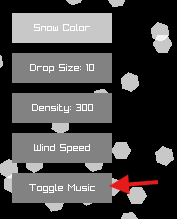
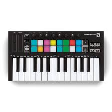

## [PERMALINK](https://sieep-coding.github.io/posts/LINQ-and-being-declarative#Adding_Music_To_My_Raylib_App)

## Adding Music To My Raylib App
For some reason, the *musician* in me awoke today. 

I decided to use my [Novation LaunchKey Mini [MK3]](https://us.novationmusic.com/products/launchkey-mini-mk3) to compose and write a simple tune for [an app I made last year](https://github.com/Sieep-Coding/snow-simulation) that has garnered interest from the public on [Github.](https://github.com/) 

The app in question is a [snowfall simulation](https://github.com/Sieep-Coding/snow-simulation) using [raylib](https://www.raylib.com/), compiled on [Linux Mint](https://linuxmint.com/) with [GCC.](https://gcc.gnu.org/)

In this blog post, I'm going to be **breaking down the code and the music composition!**

Let's dive in.

# Programming
I decided to tackle the programming first, I'm more comfortable in **VSCode** compared to [Ableton.](https://www.ableton.com/en/)

#### Adding the button
I added a button under the other buttons already on the screen, it simply toggles the music on and off. More on the logic later.
```c
Vector2 playMusicPos = {padding + 10, padding + 170};
DrawRectangle(playMusicPos.x, playMusicPos.y, buttonWidth, buttonHeight, GRAY);
DrawText("Toggle Music", playMusicPos.x + buttonWidth / 2 - MeasureText("Toggle Music", 10) / 2, 
                         playMusicPos.y + buttonHeight / 2 - 5, 11, WHITE);
```


We make use of various functions/classes built into raylib here, including `DrawRectangle();`, `Vector2`, and `DrawText();`.

> These built in functions/classes allow us to build UIs in C easily!

#### The button (red arrow)


#### Adding the logic to play music

Adding the [control flow](https://en.wikipedia.org/wiki/Control_flow) to play the music when the button is clicked was simple.

```c
Rectangle playMusicButton = {10, 170, 75, 30};
    if (CheckCollisionPointRec(mousePos, playMusicButton))
    {
        if (soundPlaying) 
        {
            soundPlaying = false;
            StopSound(sound);
        } 
        else
        {
            soundPlaying = true;
            PlaySound(sound);
        }
    }
```

and in our header file:

```c
bool soundPlaying = false;
```

Within our `main` function, we check if the left mouse button is being pressed and grab the mouse position at the time its clicked.

From there, we can simply stop the sound, or play it!

That was basically all the code I had to write (besides a small [refactor](https://en.wikipedia.org/wiki/Code_refactoring)) in order to play the music.

**Now onto the music.**

# Music Composition
For music production, I use [Ableton Live 12 Lite](https://www.ableton.com/en/) and a [Launchkey Mini MK3](https://us.novationmusic.com/products/launchkey-mini-mk3).



1. **Creating a Soft Pad**: I started by creating a soft, ambient pad for the background. This pad will give the track a dreamy atmosphere that blends well with the falling snow.

2. **Adding Chord Progression:** For a relaxing vibe, I laid down a repetitive chord progression. Something soft & organic, like C - G - A - F, played on the pad.

3. **Adding Drums and Bassline:** To keep it chill but moving, I added a slow 808 drum pattern with a simple kick, snare, and hi-hat pattern.

4. **Fine-Tuning Effects:** I added some reverb and delay to the pad to give it a spacious, ambient feel.

> You can listen to the song I made below 👇
<iframe width="75%" height="200" scrolling="no" frameborder="no" allow="autoplay" src="https://w.soundcloud.com/player/?url=https%3A//api.soundcloud.com/tracks/2054024632&color=%23ff5500&auto_play=false&hide_related=false&show_comments=true&show_user=true&show_reposts=false&show_teaser=true&visual=true"></iframe><div style="font-size: 10px; color: #cccccc;line-break: anywhere;word-break: normal;overflow: hidden;white-space: nowrap;text-overflow: ellipsis; font-family: Interstate,Lucida Grande,Lucida Sans Unicode,Lucida Sans,Garuda,Verdana,Tahoma,sans-serif;font-weight: 100;"><a href="https://soundcloud.com/nella007" title="nella" target="_blank" style="color: #cccccc; text-decoration: none;">nella</a> · <a href="https://soundcloud.com/nella007/snowfall" title="snowfall" target="_blank" style="color: #cccccc; text-decoration: none;">snowfall</a></div>


# Conclusion

Adding music to my *raylib* app wasn’t as difficult as I thought it would be. 

Thanks to the simplicity of *raylib*, I was able to integrate it quickly with just a few lines of code. 

The music itself was a fun challenge, **especially with my Launchkey Mini guiding me through the composition process in Ableton.**

If you’re looking to add music to your own project, I hope this breakdown gives you inspiration!

[View the full code on Github!](https://github.com/Sieep-Coding/snow-simulation/) 

Written By [Nick Stambaugh](https://www.linkedin.com/in/nick-s-694241139/)