## Why I Love Chicago As A Michigander

### Introduction

Hey all! 

This time I'm back traveling, talking about my recent trip to the Windy City.

Growing up in Michigan, I’ve always had a healthy respect for [Chicago](https://en.wikipedia.org/wiki/Chicago). My dad took me somewhat often as a kid and as I got older, I have now been dozens of times. 

> Chicago is the true big brother of the Midwest

It is full of [rich history](https://www.choosechicago.com/culture/), [world-class attractions](https://www.tripadvisor.com/Attractions-g35805-Activities-Chicago_Illinois.html), and a food scene that doesn’t quit.

It’s the [third largest city in the United States](https://www.census.gov/quickfacts/fact/table/chicagocityillinois) and an economic engine in it's own right. Seeing the big buildings, reminiscent of [New York City](https://en.wikipedia.org/wiki/New_York_City), always gives me a shot of 'Merican spirit. You are immediately reminded of the sheer scale and dominance that America maintains through its workhorse cities.

There’s a specific kind of Midwestern work ethic here that resonates with me as an engineer and entrepreneur. It's built on grit and innovation, to the backdrop of a beautiful skyline.

### Architecture and the Urban Grid

The [Chicago skyline](https://www.gettyimages.com/photos/chicago-skyline) is arguably the best in the world.

From the gothic heights of the Tribune Tower to the sheer glass ambition of the Willis Tower (I'll always call it the Sears Tower), the urban landscape is stunning. 

While Houston relies on sprawl, Chicago relies on density and a beautiful, walkable grid. Taking a river cruise through the city really hammers home how intentional and grand the architecture is. The way the city interacts with the [Chicago River](https://en.wikipedia.org/wiki/Chicago_River) and the vast expanse of Lake Michigan is something I’ve always admired.

You can always find [Greek inspired architecture](https://en.wikipedia.org/wiki/Ancient_Greek_architecture) in these kinds of cities, which is a personal favorite. Like in the [Union Station](https://en.wikipedia.org/wiki/Chicago_Union_Station).

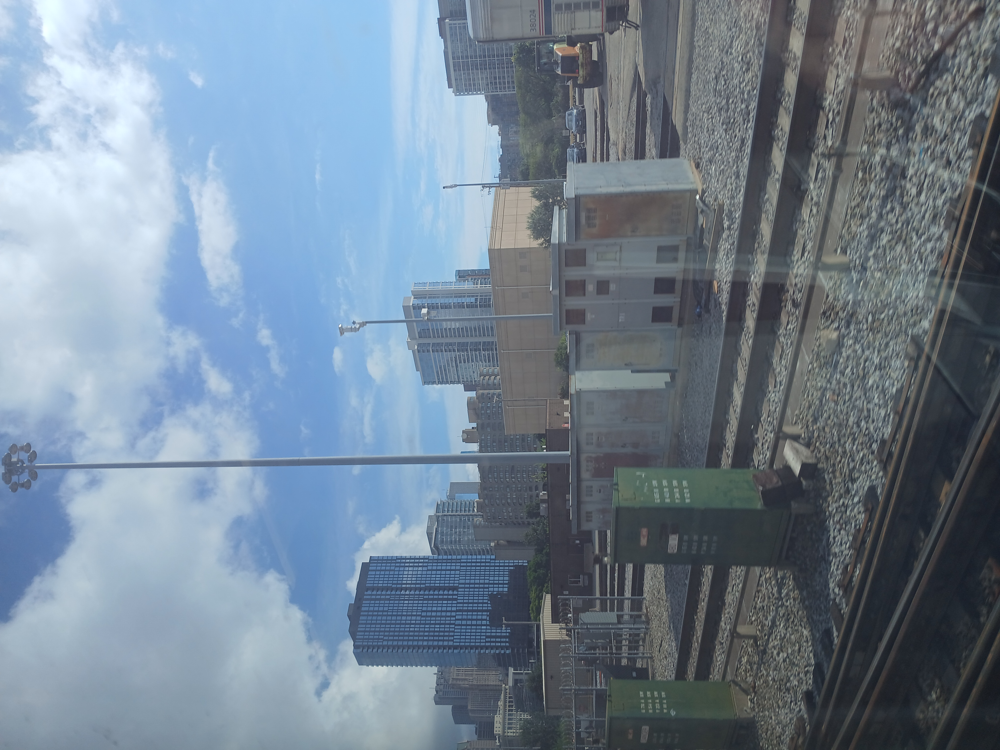
> Rust belt vibes towards the [South Side](https://en.wikipedia.org/wiki/South_Side,_Chicago)

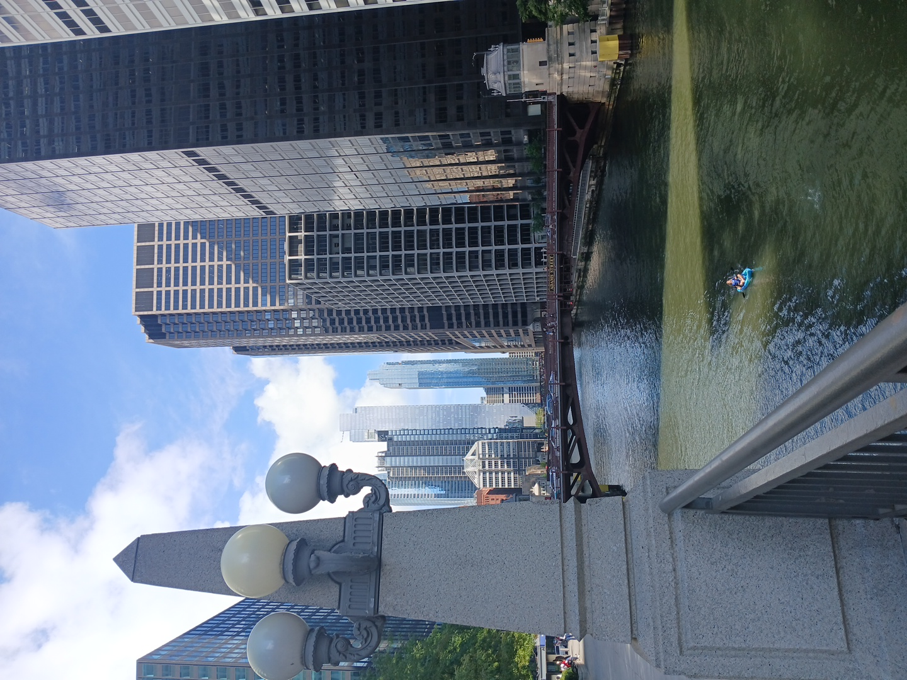
> [Chicago River](https://en.wikipedia.org/wiki/Chicago_River)

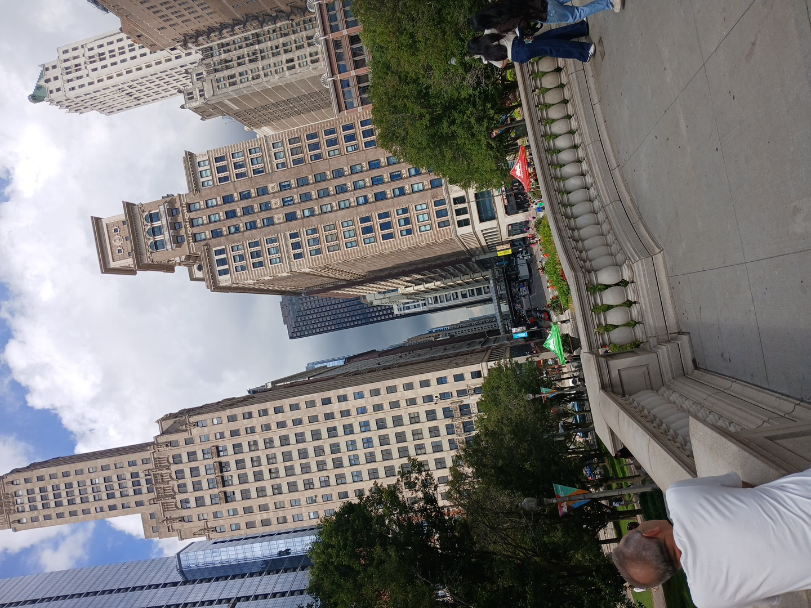
> Influencer's love this spot, I assume because of the symmetry caused by the buildings 

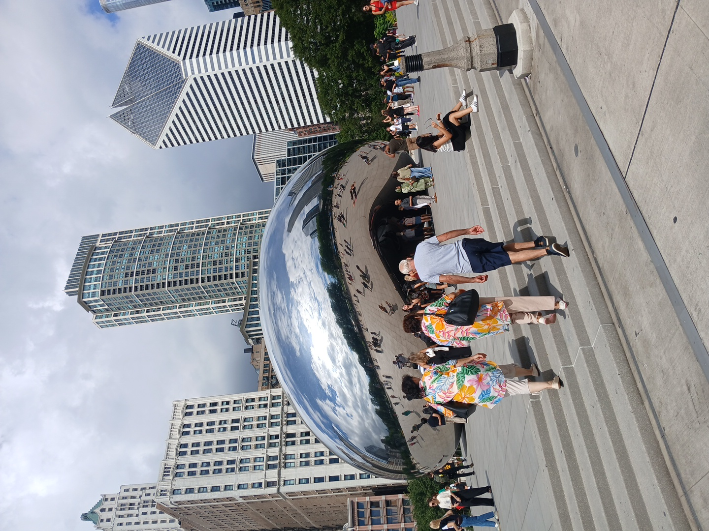
> The Bean

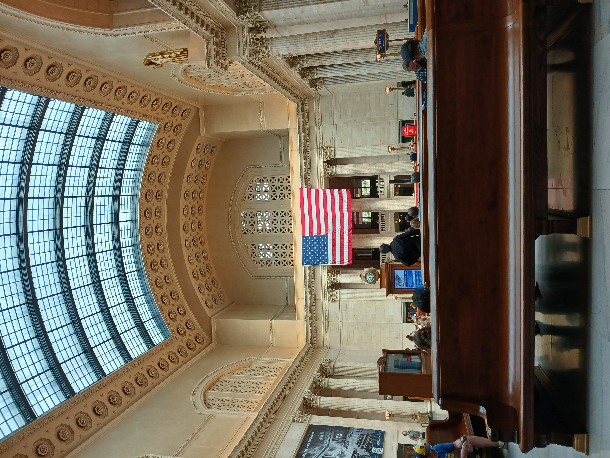
> [Union Station](https://en.wikipedia.org/wiki/Chicago_Union_Station)

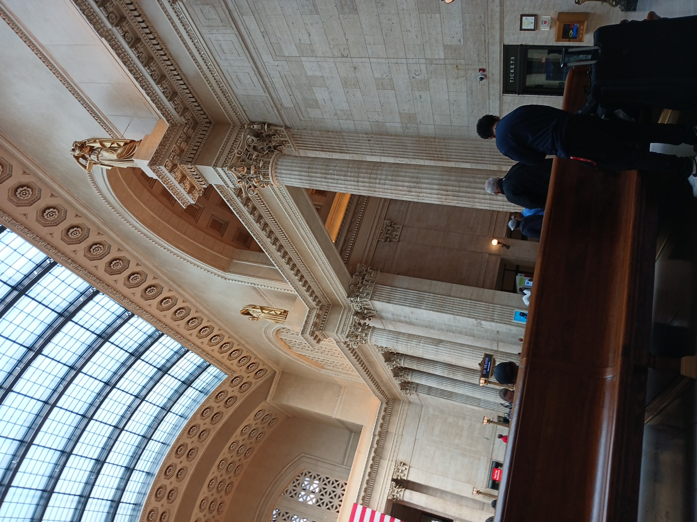
> [Union Station](https://en.wikipedia.org/wiki/Chicago_Union_Station)

### The Shadow of the Outfit

Beyond the skyscrapers, there’s a grit to Chicago’s history that I find utterly fascinating. I spent a lot of time reading about the era of [Lucky Luciano](https://en.wikipedia.org/wiki/Lucky_Luciano), the bootleggers, and of course, [Al Capone](https://en.wikipedia.org/wiki/Al_Capone) and the [Chicago Outfit](https://en.wikipedia.org/wiki/Chicago_Outfit).

There is something strangely captivating about those stories. They feel like the urban equivalent of an old Western. 

You have these larger-than-life figures operating on the frontier of a new, industrialized America, carving out their own power through sheer force of will and a complex code of honor. The mythology of the "outlaw" building an empire is a massive part of the American psyche that I can't help but admire from a historical perspective.

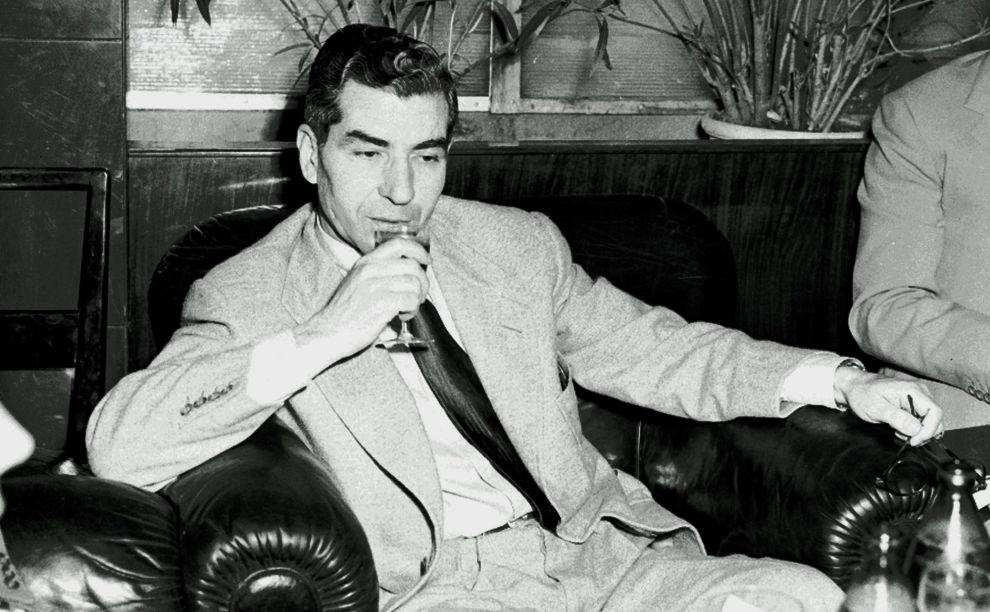
> [Charles "Lucky" Luciano](https://en.wikipedia.org/wiki/Lucky_Luciano) relaxing in Rome

### Wild Life in the City

> It’s rare to find such high-quality wildlife exhibits nestled right into the heart of a massive metro area.

[Lincoln Park Zoo](https://www.lpzoo.org/) is a total gem and the fact that it’s free is a massive win. Walking through the grounds, it’s easy to forget you’re surrounded by some of the most expensive real estate in the country. It’s a perfect escape that keeps you grounded while you're exploring the urban landscape.

You can also check out the [Brookfield Zoo](https://www.brookfieldzoo.org/visit) if you don't mind spending the money for entry. It is worth it!

Then there’s the [Shedd Aquarium](https://www.sheddaquarium.org/). The aquatic shows are top-tier, and the way they utilize the lakefront setting makes it feel like an extension of the Great Lakes I grew up with. Watching the marine life against the backdrop of the city skyline is a unique experience that really highlights how Chicago integrates nature into its massive footprint.

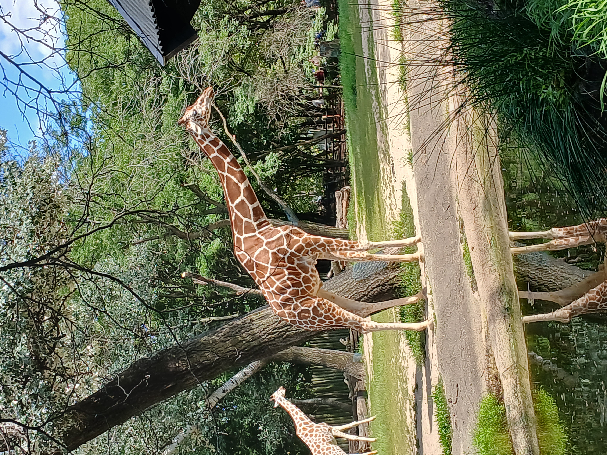
> Giraffe in The [Brookfield Zoo](https://www.brookfieldzoo.org/visit)

### The Culinary Game

Let's talk food. We all know about the deep-dish debate, but Chicago’s real culinary strength lies in its diversity. 

From the high-end steakhouses that pay homage to the city’s industrial stockyard roots to the incredible neighborhood spots serving everything from authentic Mexican to refined fine dining, there is no shortage of "killer spots" to dine at. 

The quality of the food scene here matches the city's size.

I highly recommend trying out Uzbekistan cuisine, I went to [ANJIR UZBEK HALAL](https://share.google/E6q5WyAJzpsC0Mjy5).

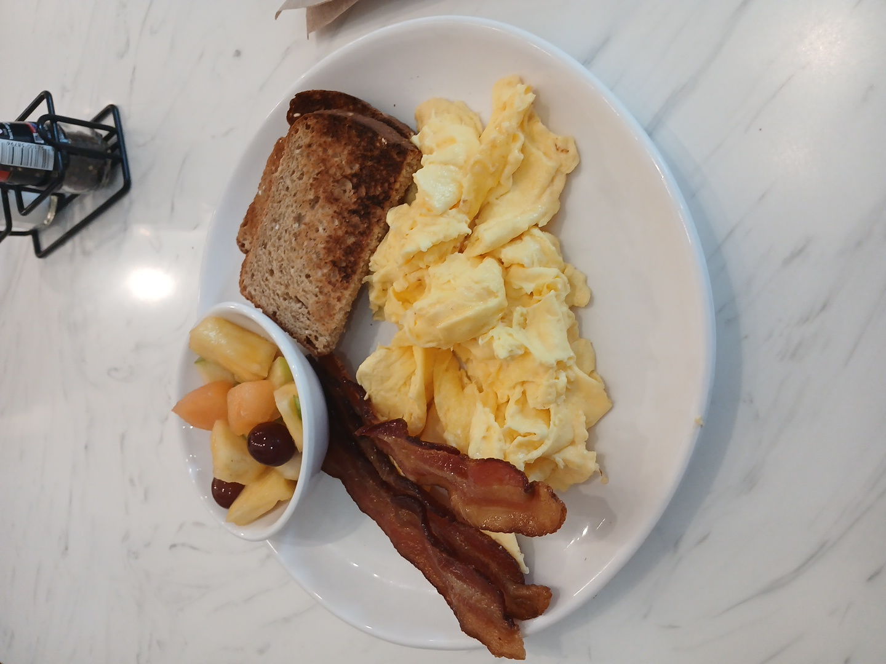
> Breakfast!

> Pasta

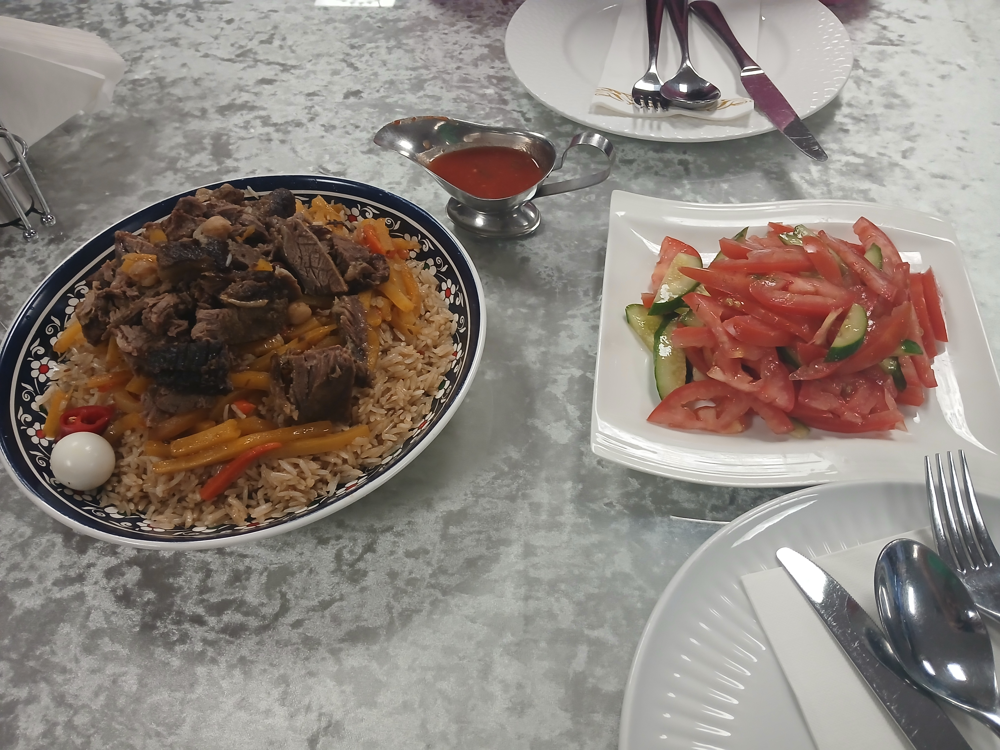
> Uzbekistan has amazing food, who knew! This is [Pilaf](https://en.wikipedia.org/wiki/Pilaf)

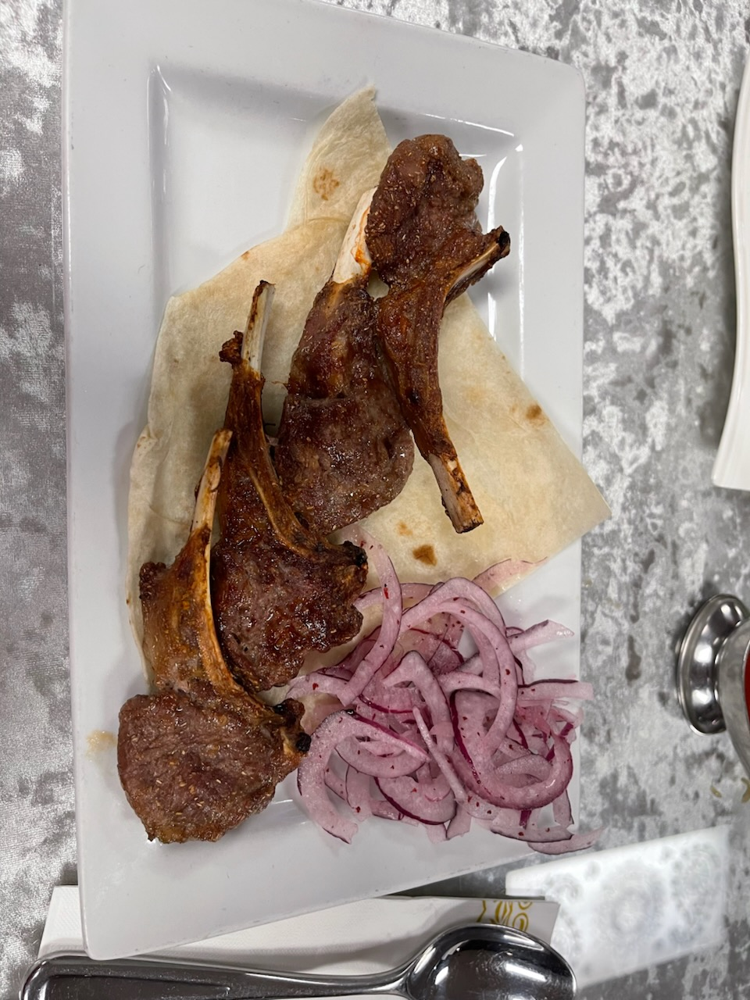
> Probably the best lamb I have ever had.

### The Chicago Sound

Much like my love for Houston rap, I’ve always been drawn to the sonic identity of Chicago. 

I grew up listening to the [Chicago hip-hop scene](https://en.wikipedia.org/wiki/Drill_music) evolve from the early days to the drill era that took over the 2010s. The city has a distinct, aggressive, and incredibly innovative musical pulse. I assure you my friends still remember all the lyrics to ['I Don't Like'](https://en.wikipedia.org/wiki/I_Don%27t_Like) and ['Favorite Song'](https://en.wikipedia.org/wiki/Favorite_Song_(Chance_the_Rapper_song)) the same way I do.

Chicago's contribution to music is undeniable. It’s the kind of sound that demands attention and reflects the hustle of a major city.

The blend of blues history and modern hip-hop gives Chicago a musical heritage that feels both deep and urgent.

There is a lot of other folks you could mention such as [Common](https://en.wikipedia.org/wiki/Common_(rapper)), [Kanye](https://en.wikipedia.org/wiki/Kanye_West), or [Lil Durk](https://en.wikipedia.org/wiki/Lil_Durk).

> Chief Keef posing for his debut album, [Finally Rich](https://en.wikipedia.org/wiki/Finally_Rich)

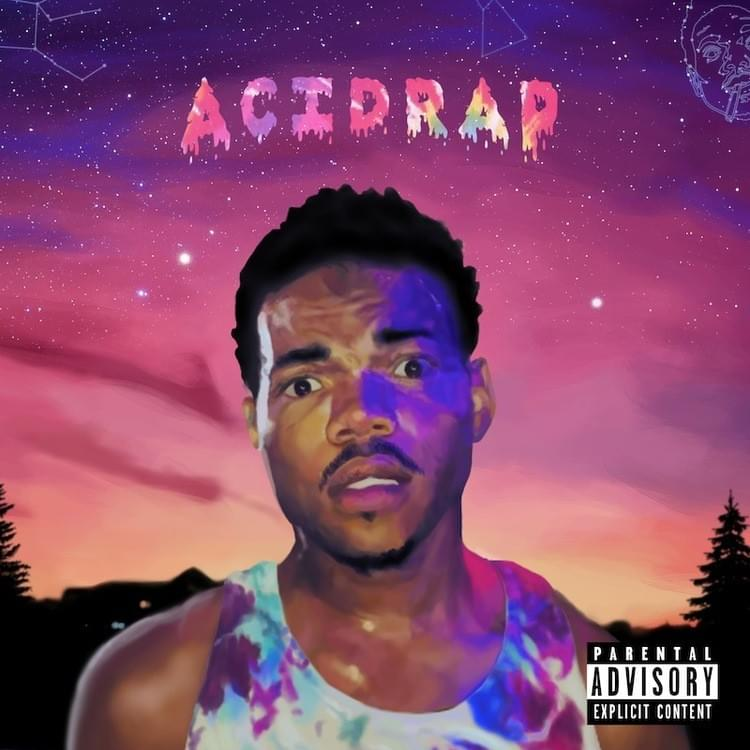
> Chance The Rapper's breakout mixtape, [Acid Rap](https://en.wikipedia.org/wiki/Acid_Rap), showed us the depth that the Chicago rap scene had in the 2010s.

## Final Thoughts

Chicago is a city that balances industrial history with modern, high-speed innovation. 

It feels familiar enough for a Michigander, but the scale and the sheer energy of the place are always a reality check. During my trip, I found amazing food, world-class museums, and a renewed appreciation for why this city remains the heart of the Midwest.

If you haven't spent time in the Loop, you're missing out on one of the greatest urban experiences in America.

## Extras

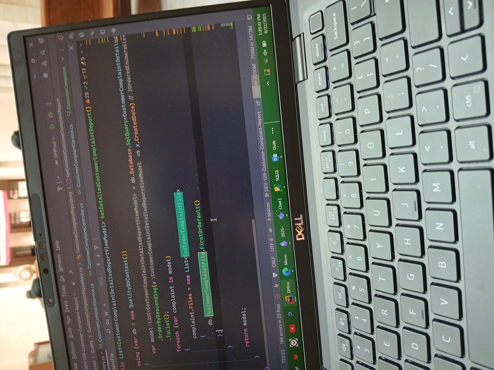
> Gettin' work done in Union Station, hit me up at [Luniv Technology](https://luniv.tech/)

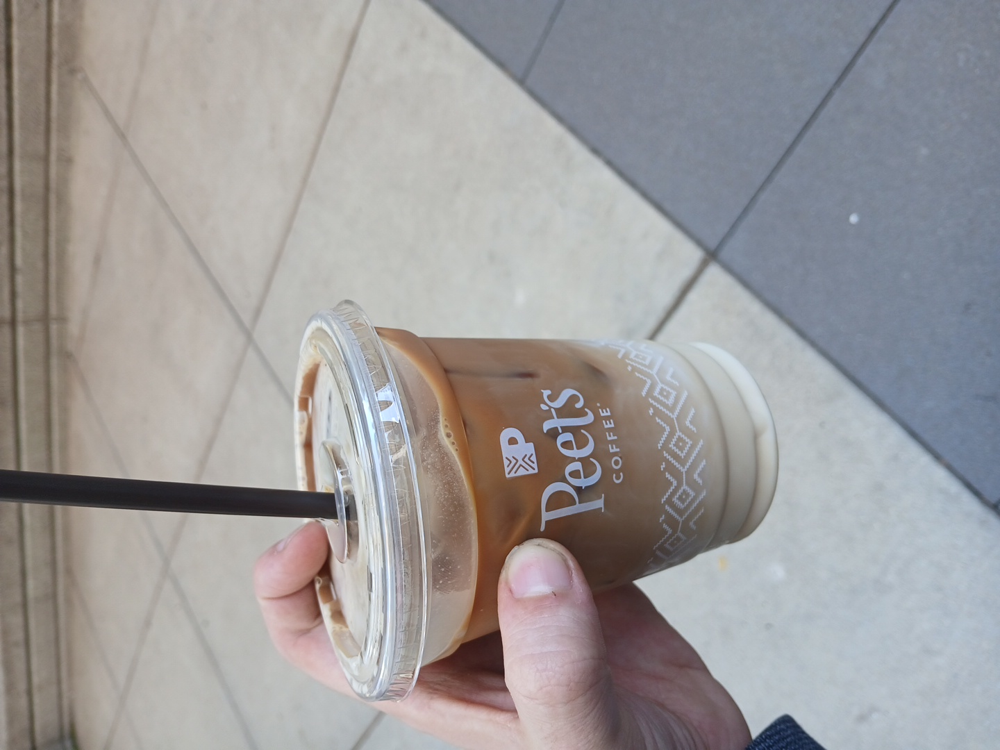
> [Peet's coffee](https://en.wikipedia.org/wiki/Peet%27s_Coffee) by the Chicago River