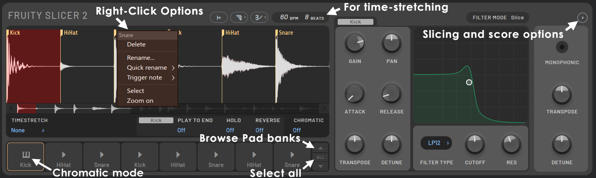

I made this using [FL Studio!](/posts/switching-back-to-fl-studio)

Every time I mention sampling in one of these posts, someone asks what I actually use to chop things up. The answer is [Fruity Slicer 2](https://www.image-line.com/fl-studio-learning/fl-studio-online-manual/html/plugins/Fruity%20Slicer%202.htm), Image-Line's built-in slicer plugin. It's not as deep as [Slicex](https://www.image-line.com/fl-studio-learning/fl-studio-online-manual/html/plugins/Slicex.htm), but for the kind of vinyl-style chopping I do, it does everything I need without getting in the way. I plan on making a song using Slicex exclusively soon.

This isn't a new plugin. It's been sitting in FL Studio for years. But I figured it was worth writing up how it actually works, since it's the backbone of tracks like [Be Yourself](/posts/making-be-yourself), where every single sound came from a sample.

## What It Actually Does

Fruity Slicer 2 takes an audio file, either detects the beats/transients in it automatically or reads existing slice markers if the file has them, and then breaks it into individual pieces called Slices. Each Slice gets mapped to a numbered Pad, and from there you can trigger them from the Piano roll or a MIDI controller, just like a normal sampler.

This is basically the same trick every old-school hip-hop producer has been doing since sampling existed, chop a loop into pieces and rearrange it into something new. Fruity Slicer 2 just automates the tedious part of finding where to cut.

> See the full documentation on the [Image Line website.](https://www.image-line.com/fl-studio-learning/fl-studio-online-manual/html/plugins/Fruity%20Slicer%202.htm)

## Loading and Slicing

You load a sample using the Load Sample icon at the top of the plugin, which opens your OS file browser. Once it's loaded, the Slicing menu gives you a few ways to actually cut it up:

- **Built-in slicing** — uses slice data already embedded in the file, if it has any
- **Dull / Medium / Sharp auto-slicing** — these control how sensitive the transient detection is, Dull gives you fewer slices, Sharp gives you a lot more
- **Beat-quantized slicing** (1/6, 1/4, 1/3, whole beat) — ignores the actual audio content and just divides the sample evenly
- **No Slicing** — treats the whole file as one Slice

For most vinyl rips and drum loops, I stick with the auto-slicing options since real recordings never land perfectly on a grid.

## Moving the Slices Around

Once it's sliced, you can drag the Marker Flags on the waveform to nudge individual cut points, or Ctrl+Click on the waveform to add new markers by hand if the auto-detection misses something. Right-clicking a Marker Flag opens a menu to rename it, delete it, or set its Trigger Note, which is the actual MIDI note that plays that Slice.

The Dump Score to Piano Roll button is where things get fun. It takes the sliced sample and writes it out as notes in the Piano roll, low to high matching first Slice to last. There are presets for this too:

- **Normal / Reverse** — plays the groove forward or backward
- **Random** — keeps the loop's length and feel but shuffles slice order
- **Flatten** — keeps the groove's timing but plays the first Slice everywhere
- **Stutter (half/quarter)** — chops each Slice further for a stutter effect
- **Crazy** — randomizes pan, pitch, and velocity per Slice

I lean on Random and Stutter a lot when I want a loop to feel chopped up but still musical, rather than just repeating the same four bars.

## Per-Slice Controls

On the right side of the plugin you get Envelope and Filter controls, Gain, Pan, Attack, Release, and filtering (Low-pass, High-pass, Band-pass), that apply either to the selected Slice or globally to all of them. This is where you can make one chopped word sound completely different from the next just by adjusting the filter cutoff or pulling the attack back.

There's also a Transpose and Detune per Slice, and a Time Stretch mode (None, Resample, or Stretch using Elastique) if you need a Slice to match the tempo of the rest of the track without pitching it up or down.

## How I Used It on "Be Yourself"

[Be Yourself](/posts/making-be-yourself) is entirely samples, no live instruments at all. The Bruce Lee clip that opens the track went through Fruity Slicer 2 first. I sliced it with the transient detection, found the exact word I wanted at the front, and set that Slice's Trigger Note so I could drop it in cold at the start with almost nothing behind it, the way you'd hear it introduced on something like Wu-Tang's [*Enter the Wu-Tang (36 Chambers)*](https://en.wikipedia.org/wiki/Enter_the_Wu-Tang_%2836_Chambers%29).

The wet guitar sample went through the same process, but I chopped it a lot more aggressively. I didn't want it looping the same way twice, so I sliced it into smaller pieces and used the Piano roll to rearrange the order depending on where I was in the song. Same source, different arrangement each time it shows up.

That's really the whole appeal of Fruity Slicer 2 for me. It turns one static audio file into a small instrument you can play, which is exactly the mentality behind albums like Nas' [*Illmatic*](https://en.wikipedia.org/wiki/Illmatic), take something that already exists and make it say something new.

If you want the deep-dive version of everything the plugin does, Image-Line's own manual covers it in more detail than I will here: [Fruity Slicer 2 documentation](https://www.image-line.com/fl-studio-learning/fl-studio-online-manual/html/basics_new_0.htm).

---

Interested in licensing or collaboration? Email me at [nickstambaugh@proton.me](mailto:nickstambaugh@proton.me)