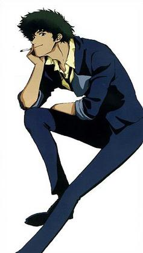
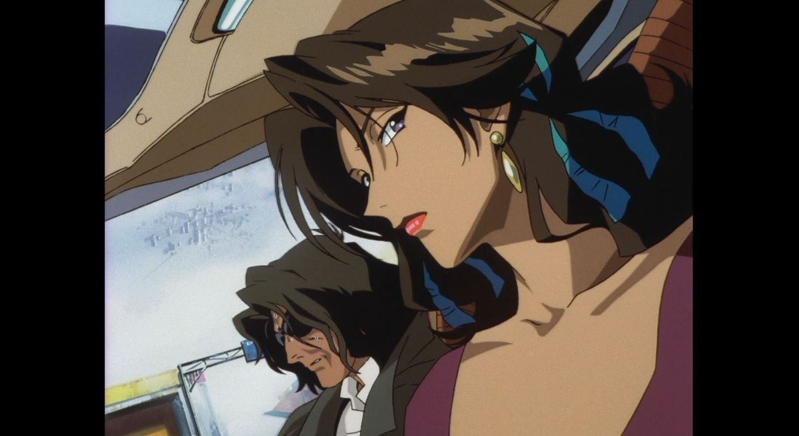
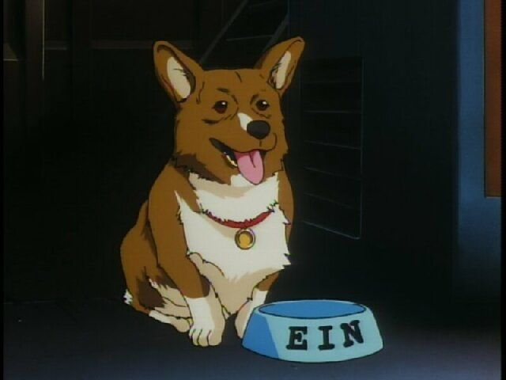
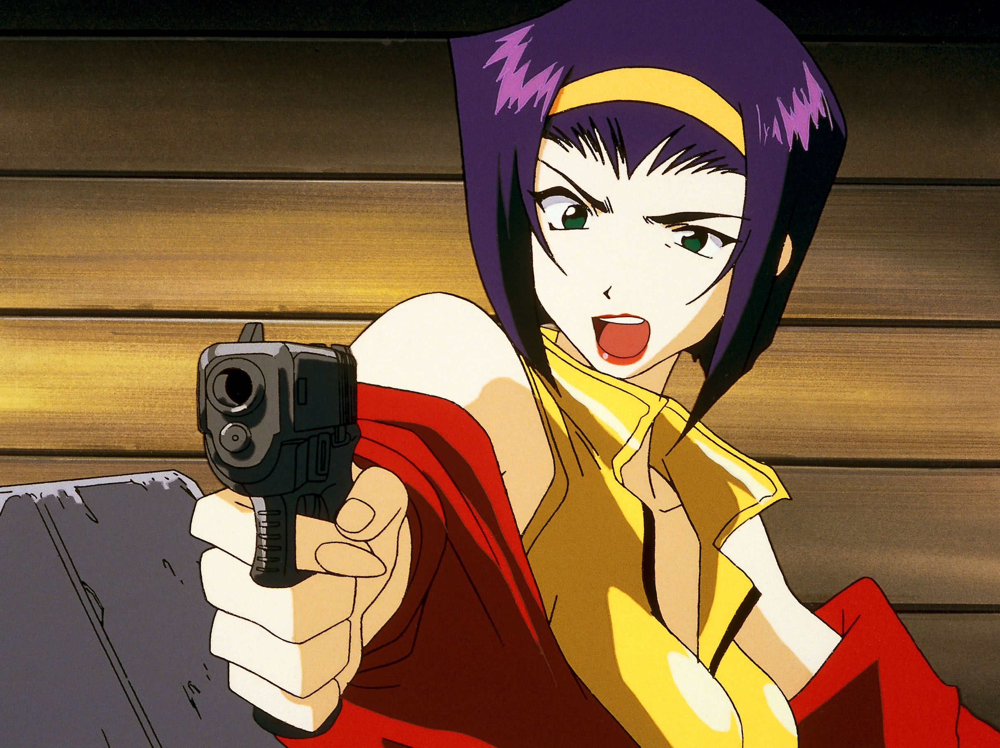
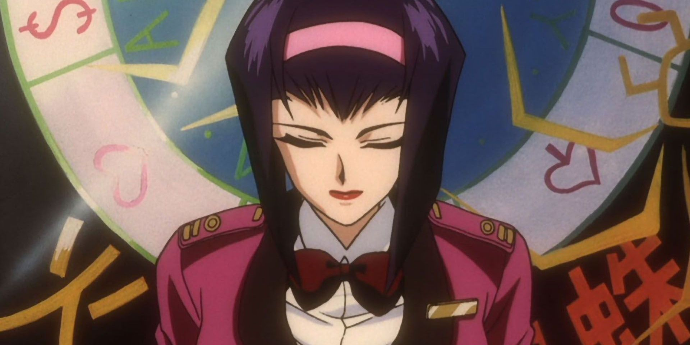
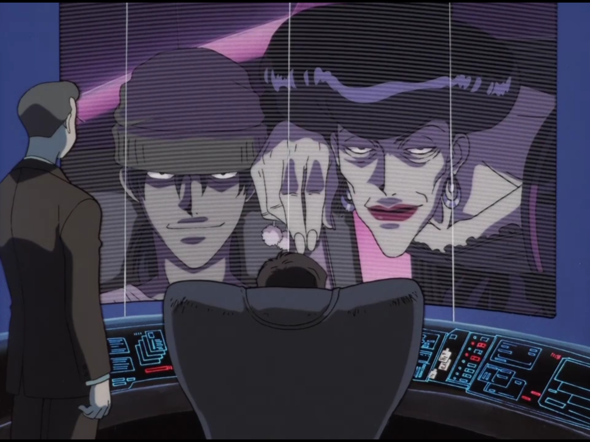

---

title: "Space Cowboys: A Review of Cowboy Bebop (Eps 1-4)"
date: "2026-06-08"

layout: ../../layouts/PostLayout.astro
description: "Diving into the first four episodes of Cowboy Bebop, where space meets a timeless Western aesthetic."

img_path : "/bebop.png"
img_alt: "Cowboy Bebop Crew"

tags: ["#Review"]

---

## Space Cowboys & Cigarettes

I’ve finally sat down to really dig into *Cowboy Bebop*. I've seen it before, but it’s been on the watchlist for a minute, and man, it hits that exact intersection of "lo-fi aesthetic" and high-stakes tension I’ve been obsessing over lately.

It’s got that gritty, blue-collar vibe that feels like a futuristic Western.

Here’s the take on the first four episodes:

### Episode 1: Asteroid Blues

The pilot sets the tone perfectly. It’s heavy on atmosphere, introducing [Spike Spiegel](https://en.wikipedia.org/wiki/Spike_Spiegel) as that classic, reluctant drifter who’s clearly running from a past he can’t outrun. The "Western in space" motif is front and center here. The bounty hunters, the harsh frontier, and that [jazz-inspired](https://en.wikipedia.org/wiki/Jazz) pulse that makes the whole thing feel urgent.

The actual bounty of the episode revolves around Asimov, a low-level criminal trying to escape Mars with his girlfriend Katerina after stealing a stash of the drug Bloody Eye. What starts as a routine payday for Spike and Jet quickly spirals into something much more tragic. Asimov isn't some larger-than-life villain. He's desperate, paranoid, and already doomed before the episode really gets moving.

What stood out to me is how little the show cares about giving you a clean victory. Spike spends the entire episode chasing the bounty, but the story isn't really about whether he catches the guy. It's about watching two people try to outrun a future that has already caught up with them. By the end, the bounty is gone, the money is gone, and Spike is left staring into space. It's a surprisingly bleak ending for a first episode, but it immediately tells you what kind of show this is.

The fight scene between Asimov and Spike is well animated and the bar shoot-out is like an anime version of [Michael Mann's](https://en.wikipedia.org/wiki/Michael_Mann) action movie [Heat](https://en.wikipedia.org/wiki/Heat_(1995_film)).

> [Spike Spiegel](https://en.wikipedia.org/wiki/Spike_Spiegel) has been impactful on pop culture, especially his drifter aesthetic

---

### Episode 2: Stray Dog Strut

This one starts to flesh out the crew dynamic, and it’s brilliant. Bringing [Ein](https://en.wikipedia.org/wiki/Ein_(Cowboy_Bebop)) into the mix adds this weird, grounded levity to the show. It’s a fun caper, but it still maintains that "hard-luck" energy I love. You can see how the series balances the high-octane action with just enough melancholy to keep you hooked.

The plot itself is wonderfully chaotic. Spike and Jet are chasing a bounty tied to a stolen briefcase while a bunch of different criminal groups are chasing the exact same target. Everyone thinks the briefcase contains something incredibly valuable, and the episode turns into a giant game of keep-away across the city.

The reveal that the prize is actually a [Pembroke Welsh Corgi](https://en.wikipedia.org/wiki/Pembroke_Welsh_Corgi) named [Ein](https://en.wikipedia.org/wiki/Ein_(Cowboy_Bebop)), a genetically enhanced "data dog". The entire episode builds up this mysterious object that everyone is willing to kill for, only for it to turn out to be a corgi. It somehow manages to be ridiculous and completely believable at the same time.

What I liked most is that the episode gives you a better sense of how bounty hunting actually works in this universe. It's messy, competitive, and usually not worth the effort. Spike and Jet are constantly one step behind, scraping by instead of looking like action heroes.

> [Ein](https://en.wikipedia.org/wiki/Ein_(Cowboy_Bebop)), the smartest member of the crew

---

### Episode 3: Honky Tonk Women

Enter [Faye Valentine](https://en.wikipedia.org/wiki/Faye_Valentine). She’s exactly the kind of "big persona" character I’m drawn to. She is sharp, opportunistic, and constantly keeping Spike and Jet on their toes. Despite this, she is shown here to be a bit of a trainwreck.

The episode kicks off with Spike pursuing a bounty at a [casino](https://en.wikipedia.org/wiki/Casino) while Faye is busy digging herself deeper into debt. The whole thing feels like a collision between a noir crime story and a Vegas heist movie. Nobody is fully in control of the situation, and everybody thinks they're smarter than everybody else.

Faye immediately changes the energy of the show. Up to this point, Spike and Jet have mostly been bouncing off each other, but Faye introduces a totally different kind of chaos. She lies constantly, gets herself into trouble almost immediately, and somehow manages to drag everyone else down with her.

I also like how the episode quietly establishes that she's more vulnerable than she wants people to believe. Underneath all the confidence and manipulation, she's basically surviving one bad decision at a time. Anyone who experienced teenage angst in their lifetime can relate to Faye. The chemistry is already starting to snap, and the way the show uses the casino setting feels like a nod to the old-school mobsters [I grew up reading about](https://nickstambaugh.dev/posts/chicago).

The way the casino owner destroys himself in a fit of rage is a showcase of the firepower available to enterprising businessmen in this universe, while also showing the lack of training required to obtain such weaponry.

> [Faye Valentine](https://en.wikipedia.org/wiki/Faye_Valentine) bringing the chaos

---

### Episode 4: Gateway Shuffle

> By the fourth episode, the world-building is firing on all cylinders.

This episode revolves around a terrorist group accidentally releasing a mysterious biological weapon. The opening immediately raises the stakes compared to the earlier episodes. Instead of one criminal or one bounty, the threat hangs over an entire population.

The investigation sends Spike and Jet chasing leads through abandoned ships, space stations, and rumors about the source of the outbreak. There's a genuine sense of uncertainty running through the entire episode. Nobody really understands what they're dealing with, which makes the threat feel bigger than the usual bounty-of-the-week setup.

What I found interesting is how the episode expands the scope of the universe without losing the show's identity. Even when the danger becomes potentially catastrophic, the focus stays on the crew trying to make a living and survive another day. The heroes never feel larger than the world around them.

The stakes feel higher, and you're starting to see the cracks in the armor of these characters. Spike acts cool, Jet acts composed, and Faye acts confident especially when she saves the day, but all three are carrying baggage that's becoming harder to ignore.

> ["Twinkle" Maria Murdock](https://cowboybebop.fandom.com/wiki/Maria_Murdock) is by far the most intimidating bounty we have seen so far.
---

## Final Thoughts

Four episodes in, what stands out most is how comfortable *Cowboy Bebop* is with failure. The crew rarely gets paid. Their plans rarely work. Most of the people they chase end up dead, escaped, or completely outside their reach.

A lesser show would make the bounty hunters feel like superheroes. *Cowboy Bebop* makes them feel like working-class drifters trying to stay afloat in a universe that doesn't care about them.

This is easily one of the best anime to watch for a beginner to the genre.

If you like your stories with a bit of smoke, a bit of brass, and a lot of attitude, this is essential viewing.

[Stay tuned for the next 4 episodes!](https://nickstambaugh.dev/posts/)