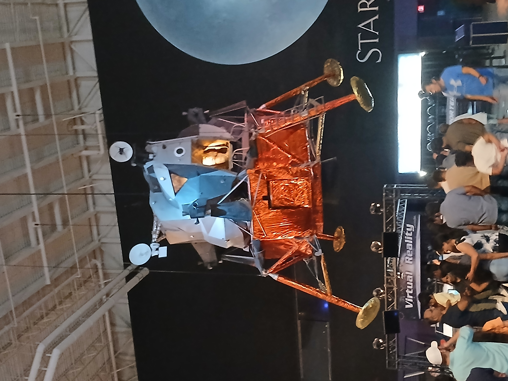

# Why I Love Houston

### Introduction

Hey all! 

This is a different type of blog than I usually do. 

I enjoyed my semi-recent trip to Houston a lot, so I figured I'd give a nod to the fantastic city.

To begin, [Houston](https://en.wikipedia.org/wiki/Houston) is an amazing city to explore, full of rich [culture](https://en.wikipedia.org/wiki/Houston#Culture), [diverse attractions](https://www.tripadvisor.com/Attractions-g56003-Activities-Houston_Texas.html), and [incredible food.](https://www.google.com/search?q=houston+food) 

Houston truly has something for everyone. It is the [fourth largest city in the United States](https://www.britannica.com/topic/Whats-the-largest-US-city-by-population) and when you are there, you feel it. Houston is home to 21 Fortune 500 company headquarters. Houston also boasts impressive [housing supply](https://fred.stlouisfed.org/series/ACTLISCOU26420) which drives home prices down.

Everything is bigger in Texas; Especially true for Houston!

### A City of Skyscrapers

The [Houston skyline](https://www.gettyimages.com/photos/houston-skyline) is a breathtaking sight, with a mix of modern architecture and looming skyscrapers. 

Driving into the city, you can't help but admire the impressive urban landscape, with towering glass buildings reflecting the Texas sun. The sprawl and car-centric nature of the city is certainly a downside, but the overall architecture is impressive nonetheless.

The city's rapid growth and innovation are evident in its ever-evolving downtown.

### A Hub for Art and History

> Houston is home to some of the best museums in the country. 

The [Museum of Fine Arts, Houston (MFAH)](https://www.mfah.org/) boasts an incredible collection of art spanning centuries, from ancient sculptures to contemporary masterpieces. 

Walking through the exhibits, you can immerse yourself in history and artistic expression from all over the world. 

The museum district itself is a must-visit for anyone who appreciates culture and creativity.

### Exploring Space at NASA

One of Houston’s most iconic attractions is the [Space Center Houston](https://spacecenter.org/). 

As the home of [NASA’s Johnson Space Center](https://www.nasa.gov/johnson/), it's a paradise for space enthusiasts. 

Visitors can see real spacecraft, touch moon rocks, and learn about humanity’s journey beyond Earth. 

It’s a place that truly inspires curiosity and ambition, reminding us of Houston’s integral role in space exploration.

### Diverse and Delicious Food

Houston’s culinary scene is just as exciting as its attractions. The seafood quality compared to my home state of Michigan was my favorite aspect.  

The city is known for its diverse food options, from authentic Tex-Mex and BBQ to international flavors from all corners of the globe. 

Whether you're grabbing tacos from a food truck or dining at a top-tier restaurant, Houston's food scene never disappoints.

### Houston Rap

## Final Thoughts

Houston is a city that blends history, innovation, and culture in a way that makes it truly unique. 

If you're a local or just visiting, you'll find a way to fall in love with Houston.

Written By [_Nick Stambaugh_](https://www.linkedin.com/in/nick-s-694241139/)