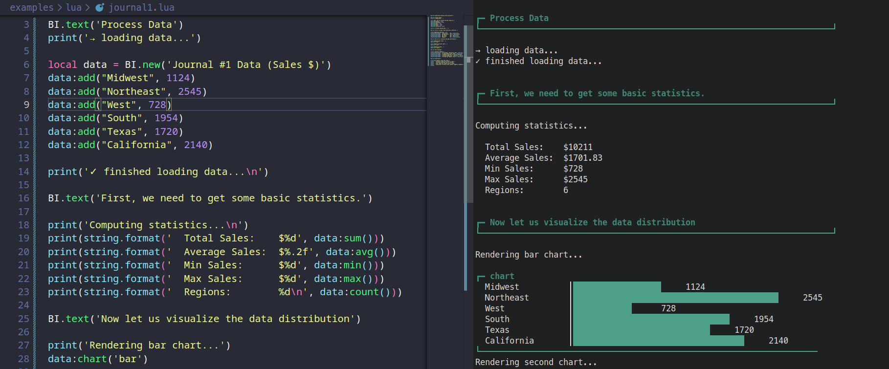

## [PERMALINK](https://nickstambaugh.dev/posts/lunivcore-bi-as-code)

## [LunivCore](https://lunivcore.vercel.app/): Business Intelligence As Code

### Introduction

[LunivCore](https://lunivcore.vercel.app/), developed by [Luniv Technology](https://www.luniv.tech/), is an innovative **Business Intelligence (BI) Engine** that fundamentally redefines how analytics and reporting are created and managed. 

Billed as **"Business Intelligence As Code,"** it moves the creation of analytical reports from drag-and-drop graphical interfaces to a developer-first workflow powered by a compact **C/Lua execution core**.

The core philosophy is to treat analytical reports as **code**, enabling engineering best practices like **version control** (Git diffing reports), **auditing**, and **peer review** of every calculation and data transformation.

---

## The LunivCore Advantage: Performance Meets Portability

LunivCore is engineered for high performance and extreme portability, making it suitable for modern, distributed data environments.


> Develop reports, dashboards, and articles all in the terminal.

### C-Level Performance and Efficiency
The engine is built around a **C core** optimized for computationally intensive tasks. 

This design allows it to achieve **Tens of Millions of Rows per Second** throughput, processing billion-row datasets in **under 30 seconds** on standard hardware. 

This speed is attributed to the core's native memory efficiency.

### Deploy Anywhere: Lightweight and Embeddable
The entire C core is exceptionally lightweight (**< 5MB**) and has **zero external dependencies**. 

This self-contained runtime allows it to be **embedded** easily into any application—from SaaS platforms to **Edge** and **IoT** devices—using a **C API** or **Lua bindings**. 

There is no database lock-in, offering maximum deployment flexibility.

### Version Control for Data Reports
By treating reports as code, LunivCore integrates seamlessly with **Git**. 

This enables teams to:

* **Git diff** their analytics to see exactly what changed between report versions.
* **Review changes** before deploying new reports.
* **Audit** every modification to calculation logic.

---

### Developer-First User Experience (UX)

LunivCore provides two primary ways for developers to interact with the engine: a new domain-specific language and powerful Lua scripting.

### The LCore DSL (Domain-Specific Language)
The engine introduces a proprietary `.lcore` syntax inspired by **Markdown**. This language is designed to be clean, minimal, and highly readable, allowing engineers to ship analytics faster than traditional BI tools.

For example, a simple report can be written concisely and output a clear text-based chart:

```bash
dataset Sales "Q1 Revenue by Region" {
    APAC: 2850000
    Americas: 3450000
    EMEA: 1920000
}

plot Sales as bar
```
### Lua Scripting for Complex Logic

For advanced use cases, Lua scripting is integrated to handle complex logic, dynamic data manipulation, and the creation of reusable analytical components like custom dashboards, value cards, and tables. 

The Lua environment communicates directly with the high-speed C core using the Lua C API, ensuring performance is maintained.

>The output from both LCore DSL and Lua scripting is auditable, readable text-based visualization, making debugging and inspection simple.

### Architecture: C Performance, Lua Flexibility

LunivCore's architecture is a strategic combination of two languages:

- **Host Language (C):** The core engine is written in C. This layer handles the computationally intensive tasks (Lexer, Parser, Executor) and efficiently manages memory for high-speed data processing.

- **Guest Language (Lua):** Lua provides a dynamic, developer-friendly scripting interface. It's used for writing the analytical logic and acts as the user-facing DSL layer.

- **The Glue (Lua C API):** A stable, high-speed bridge that securely and efficiently passes data and commands between the C and Lua environments, leveraging the benefits of both.

## Conclusion

[LunivCore](https://lunivcore.vercel.app/) is an open-source, MIT-licensed project built to serve the needs of modern engineering teams. 

It provides a unique blend of C-level performance, portability, and developer-first tooling, making it an intriguing alternative to traditional, often proprietary, BI platforms. 

Its commitment to treating analytics as version-controlled code is a key differentiator for organizations aiming for higher auditability and data governance.

*Written By [Nick Stambaugh](https://www.linkedin.com/in/nick-s-694241139/)*
