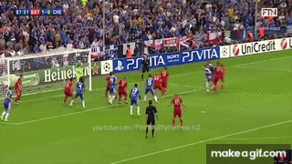
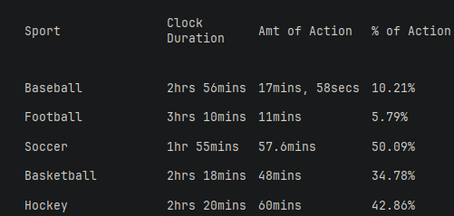
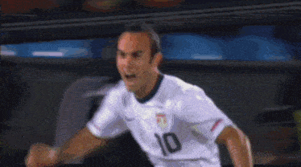

# My Thoughts On Soccer and Why It Is The Best Sport
As we Americans call it, [soccer](https://en.wikipedia.org/wiki/Association_football) is truly a global phenomenon. Despite this, it has never truly gripped America the same way it has other nations.

With the [FIFA World Cup](https://en.wikipedia.org/wiki/FIFA_World_Cup) being held in my home country of America this year, I thought there may be new interest in soccer here. If that's the case, I hope I can explain to newcomers why this sport is the best.

It comes down to a few key aspects:
 - Accessibility
 - Simplicity
 - Global reach

### How would I know?
I'm certainly no British scholar who can list 40 different [defensive formations](https://en.wikipedia.org/wiki/Formation_(association_football)) off the top of my noggin, but I grew up playing and watching soccer my entire life. Some of my greatest memories growing up were spent on the field with some of my best friends. To many of my peers, American athletes like [LeBron James](https://en.wikipedia.org/wiki/LeBron_James) and [Tom Brady](https://en.wikipedia.org/wiki/Tom_Brady) were who they looked up to.

I believe the first [footballers](https://en.wikipedia.org/wiki/Football_player) I wanted to emulate were [Kaká](https://en.wikipedia.org/wiki/Kak%C3%A1), [Ronaldo Nazário](https://en.wikipedia.org/wiki/Ronaldo_(Brazilian_footballer)) and [Ronaldinho](https://en.wikipedia.org/wiki/Ronaldinho), all Brazilian. I distinctly remember watching them on YouTube on the family computer at a very young age. 

The first moment that truly inspired me in sports was watching [Didier Drogba](https://en.wikipedia.org/wiki/Didier_Drogba) [score](https://www.youtube.com/watch?v=HurD4piyXY8)  in the last minute on German soil against [Bayern Munich](https://en.wikipedia.org/wiki/FC_Bayern_Munich) to tie the game. 

Drogba, cementing himself in London folklore, goes on to sink the game-winning [penalty kick](https://en.wikipedia.org/wiki/Penalty_kick_(association_football)) 20 minutes later.

> Drogbaaaaaaaa! - Martin Tyler

### Accessibility
There is no sport more accessible than soccer. All you need is a round object!

Growing up, we would just put down two shoes for goal posts.

This aspect of the game is what allows it to thrive in all places. It doesn't matter if you are rich or poor. It is the same for everyone and the objective remains simple: put the ball in the back of the net.

### Simplicity
The rules of soccer have gotten increasingly complex with the introduction of technology to assist a referee during the game. Despite this, **the rules remain significantly simpler than all American sports.** American culture is dominated by litigation and rules, the sports reflect this.

The clock in the game always runs and the stoppages are minimal. This creates a better viewing experience compared to American football, where viewers can expect about [11 minutes](https://qz.com/150577/an-average-nfl-game-more-than-100-commercials-and-just-11-minutes-of-play) of action. Soccer, on the other hand, contains the highest percentage of action the viewer sees of any sport.

> This data is from the 2010s but I doubt it has changed much, let alone gotten better!

### Global reach
The FIFA World Cup is the biggest sporting event globally. This gives small countries a chance to show themselves on the global stage outside of the Olympics opening ceremony. It gives Europeans and South American countries a chance to shit on everyone else. 

Players are representing their country, their families, and millions of people back home.

### Storytelling

Every soccer fan has *that* moment.

It might be a last-minute winner, an impossible comeback, or a penalty shootout that leaves an entire nation holding its breath. For me, it was Didier Drogba's equalizer and [Landon Donovan scoring against Algeria](https://www.youtube.com/watch?v=b7eZmKWW9s4) in the World Cup.

> Go, Go, USA! - Ian Darke

Soccer produces stories that people remember for decades because there is so much on the line. Promotion, relegation, rivalries spanning over a century, and international tournaments played only once every four years all raise the stakes.

The beauty is that every fan has a different story. Ask someone why they fell in love with soccer, and chances are they'll tell you about a specific match, a specific goal, or a specific player.

### Rivalries

Some rivalries have existed for over a century and are rooted in far more than sport. 

They represent cities, regions, politics, religion, and generations of family tradition.

Entire stadiums sing for ninety minutes. Even if you've never watched either team before you can immediately tell that the match means something.

The best part is that these rivalries never really disappear. Every new generation inherits the same passion as the one before it, similar to college football in America.

## Final Thoughts

Maybe I'm biased because I grew up with the sport. But I genuinely believe soccer is the greatest sport ever created.

It's accessible to everyone, simple enough for anyone to enjoy, yet deep enough to spend a lifetime appreciating. There is always a new tactic to learn or a new trend to follow. It has the biggest stage in sports, the greatest atmosphere, and moments capable of bringing entire nations to tears.

No matter where you're from, soccer has a place for you.