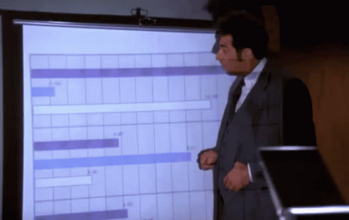

## Reflecting on Two Years as a Software Engineer in the Midwest
<<<<<<< HEAD

It's been a [long journey](/about) to create a tech career. The work you have to put in to get a job writing code is substantial. For reference, I started writing code over ten years ago at this point. The first time I got paid to write code was in 2015. I have a bachelor's in [economics](https://en.wikipedia.org/wiki/Economics) and took the time to learn IT skills during high school through the phenomenal [Kent ISD](https://en.wikipedia.org/wiki/Kent_Intermediate_School_District) program called [KCTC.](https://www.thetechcenter.org/)

Secret, there was never really a straight line into [software development.](https://en.wikipedia.org/wiki/Software_development)

Like a lot of other people who end up writing code for work, I bounced around. I worked jobs that weren't what I wanted to do while writing software at night, almost every night. I spent my evenings building projects, learning [web frameworks,](https://en.wikipedia.org/wiki/Web_framework) reading [documentation,](https://en.wikipedia.org/wiki/Software_documentation) and wondering if I would ever amount to anything beyond a [GitHub](https://en.wikipedia.org/wiki/GitHub) repository with three stars. I sacrificed the majority of my social life in order to get to this point (I don't recommend that).

I think one thing that gets overlooked when people talk about software work is just how competitive it is. 

The advice of "just learn to code" was beginning to wear off by the time I was in college and today the market is dramatically different. AI driven portfolios and projects are everywhere. Also, hundreds or even thousands of applicants can apply for a single [entry-level position.](https://en.wikipedia.org/wiki/Entry-level_job) I've applied for (and gotten) jobs where I've competed against over 1000 applicants from across the globe. Now that is a satisfying feeling!
=======
It's been a [long journey](/about) to create a tech career. The work you have to put in to get a job writing code is substantial. For reference, I started writing code over ten years ago at this point. The first time I got paid to write code was in 2015. I have a bachelor's in economics and took the time to learn IT skills during high school through the phenomenal [Kent ISD](https://en.wikipedia.org/wiki/Kent_Intermediate_School_District) program called [KCTC.](https://www.thetechcenter.org/)

Secret, there was never really a straight line into software development.

Like a lot of people in Michigan, I bounced around. I worked jobs that weren't what I wanted to do while continuing to write software at night, almost every night. I'd spend my evenings building random projects, learning new frameworks, reading documentation, and wondering if it would ever amount to anything beyond a GitHub repository with three stars. Some freelance work started picking up, I eventually found work doing something tech-adjacent and continued to etch myself closer to a software job. I sacrificed the majority of my social life in order to get to this point.

One thing I think gets overlooked when people talk about getting into software is just how competitive it is. 

The advice of "just learn to code" was beginning to wear off by the time I was in college, and today the market is dramatically different. AI driven portfolios and projects are everywhere. Hundreds or even thousands of applicants can apply for a single entry-level position. I've applied for (and gotten) jobs where I've competed against over 1000 applicants from across the globe. Now that is a satisfying feeling!
>>>>>>> 2b4452f5d5c655f1c144ed38dd02315c0735d836

> I say this because I think people deserve an honest picture of what they're signing up for.

#### There's always something interesting to learn.
<<<<<<< HEAD
In many ways, getting a job in programming is the worst thing you can do if you actually enjoy it, that is when the real learning begins. Over the years I've accumulated what feels like an endless collection of technologies. Almost none of which I signed up to learn. [C#](https://en.wikipedia.org/wiki/C_Sharp_(programming_language)), [SQL Server](https://en.wikipedia.org/wiki/Microsoft_SQL_Server), [ASP.NET MVC](https://en.wikipedia.org/wiki/ASP.NET_MVC), [Razor](https://en.wikipedia.org/wiki/ASP.NET_Razor), [JavaScript](https://en.wikipedia.org/wiki/JavaScript), [TypeScript](https://en.wikipedia.org/wiki/TypeScript), [React](https://en.wikipedia.org/wiki/React_(software)), Astro, [Power BI](https://en.wikipedia.org/wiki/Microsoft_Power_BI), [Python](https://en.wikipedia.org/wiki/Python_(programming_language)), [Git](https://en.wikipedia.org/wiki/Git), [Linux](https://en.wikipedia.org/wiki/Linux), [Azure](https://en.wikipedia.org/wiki/Microsoft_Azure), [Microsoft Dynamics AX 2009](https://en.wikipedia.org/wiki/Microsoft_Dynamics_AX), [REST APIs](https://en.wikipedia.org/wiki/API), [Entity Framework](https://en.wikipedia.org/wiki/Entity_Framework)... the list keeps growing every year.

When people imagine programmers they often picture someone making $600k, wearing a slick Patagonia vest, working 20 hrs a week at [Google](https://en.wikipedia.org/wiki/Google) or [Microsoft](https://en.wikipedia.org/wiki/Microsoft) writing the next billion-dollar application. 
=======
In many ways, getting a job in programming is the worst thing you can do if you actually enjoy it, that is when the real learning begins. Over the years I've accumulated what feels like an endless collection of technologies. Almost none of which I signed up to learn. C#, SQL Server, ASP.NET MVC, Razor, JavaScript, TypeScript, React, Astro, Power BI, Python, Git, Linux, Azure, Microsoft Dynamics AX 2009, REST APIs, Entity Framework... the list keeps growing every year.

When people hear "software engineer," they often picture someone making $600k, wearing a slick Patagonia vest, working 20 hrs a week at Google or Microsoft writing the next billion-dollar application. 
>>>>>>> 2b4452f5d5c655f1c144ed38dd02315c0735d836

The reality for most of us is a lot less glamorous.

<<<<<<< HEAD
Working in [manufacturing](https://en.wikipedia.org/wiki/Manufacturing) has given me a greater appreciation for high quality software. When your code crashes on a [social media](https://en.wikipedia.org/wiki/Social_media) site, someone might not see a picture or some dumb [tiktok](https://en.wikipedia.org/wiki/TikTok) about aliens building the pyramids. When your code crashes in a manufacturing environment, production can stop and people are *pissed* at *you*. The other thing that's surprised me is just how much of [software engineering](https://en.wikipedia.org/wiki/Software_engineering) has nothing to do with it. You spend a lot of time talking to people. Understanding [business processes.](https://en.wikipedia.org/wiki/Business_process) Figuring out what someone actually means when they describe a problem. I don't think college prepared me for that part.
=======
Working in manufacturing has given me a greater appreciation for high quality software. When your code crashes on a social media site, someone might not see a picture or some dumb tiktok about aliens building the pyramids. When your code crashes in a manufacturing environment, production can stop and people are *pissed* at *you*. The other thing that's surprised me is just how much of software engineering has nothing to do with it. You spend a lot of time talking to people. Understanding business processes. Figuring out what someone actually means when they describe a problem. I don't think college prepared me for that part.
>>>>>>> 2b4452f5d5c655f1c144ed38dd02315c0735d836
