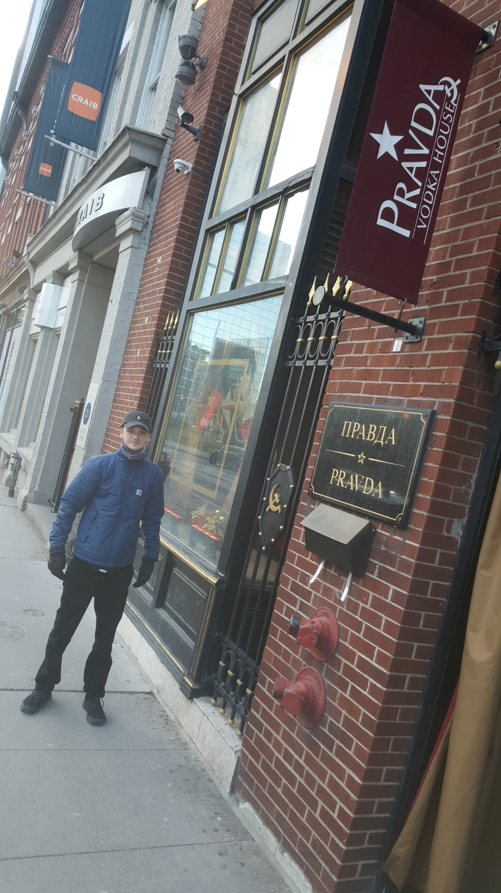
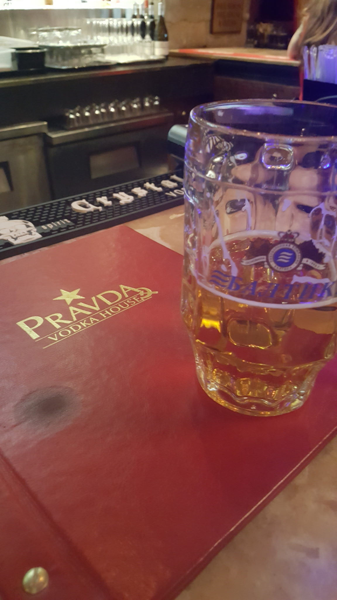
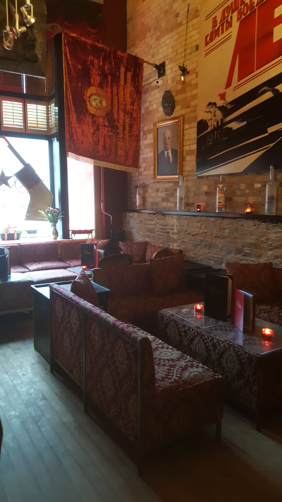

# Remembering and Discussing Pravda Vodka Bar
Is it correct to turn the ghosts of history into decor?

I stumbled upon Pravda Vodka Bar during my travels in Toronto, Canada around 2022. As you can see from the images, it is a restaurant I've never forgotten.

> Cyrillic sign of Pravda, and me!

Having learned of Pravda shutting down (I think around May 2024), I wanted to share my thoughts on this place and provide it a slice on the internet where it can live forever since it was unique. I don't mean to be offensive to anyone. I simply enjoy preserving history when I see an opportunity to do so.

I grew up in America in the 2000s. The 'red scare' and America's general fear of Russians/Communists had shifted to other ethnic groups by this time. Despite this, you would *never* see a bar like this in America outside of maybe New York City and a handful of other massive cities.

## The Aesthetic
Pravda Vodka Bar was a classy piano bar with a wide variety of authentic Soviet Union memorabilia on display (I learned that it was authentic from the bartender). 

- The Irony: Capitalism in a Soviet bar. Need I say more?
- Packaging the Past: It transformed a traumatic reality into a stylistic choice. Stalin's communist policies resulted in millions of deaths, historians estimate over 20 million. This history was stripped of any true weight and turned into a backdrop.

It functioned as a museum for a dead ideology while also being curated for the modern consumer. 

> Russian beer!

## The Blurred Line

The existence of establishments like Pravda Vodka Bar highlights a peculiar human tendency: our desire to aesthetics of the "forbidden." By placing symbols of a regime responsible for systemic oppression into a setting defined by luxury, alcohol, and leisure, the bar created a cognitive dissonance that was both its draw and its most controversial element, [as noted by its last owner before it closed.](https://torontolife.com/food/pravda-vodka-house-toronto-brash-and-sassy/)

As we move further from the 20th century, the distance between historical tragedy and cultural commodity will shorten. If a regime that collapsed in the early 90s can be turned into a trendy piano bar by the 2010s or earlier, we must ask what happens when more highly polarized historical events are given the same treatment. If we continue to package history without the burden of its original weight, we risk creating a culture of historical amnesia.

> Soviet decor

## Final Thoughts
Do you believe these spaces honor history? Or do they strip away the truth for the sake of an atmosphere and profit?
