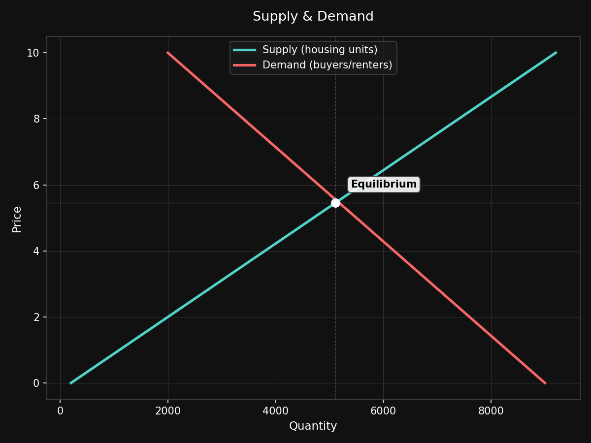
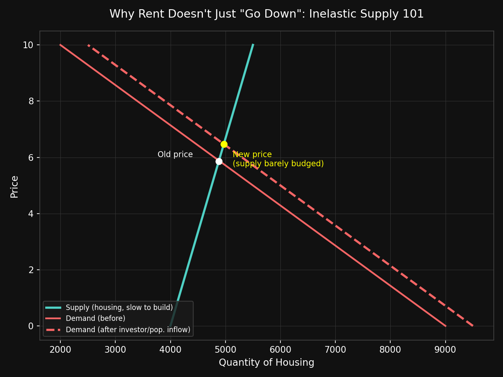

# Reteaching You Supply and Demand Since You Forgot

Since I last tackled the [myths](https://en.wikipedia.org/wiki/Myth) surrounding the [American labor force](/posts/the-labor-force-never-fully-came-back), I keep seeing the same arguments every week: 
- [rent](https://en.wikipedia.org/wiki/Economic_rent) is high because [landlords](https://en.wikipedia.org/wiki/Landlord) are [greedy](https://en.wikipedia.org/wiki/Greed) 
- you can't move out of your mom's basement because of a [$3 McChicken](https://menupricetracker.com/mcdonalds-menu/mcchicken) 
- and [home prices](https://en.wikipedia.org/wiki/Affordable_housing_by_country) are high because [BlackRock](https://en.wikipedia.org/wiki/BlackRock) personally bought your childhood home.

Since none of you have opened an [econ 101](https://en.wikipedia.org/wiki/Economics) textbook since high school, against my better judgment, here's a refresher.

---

## The Two Lines You Keep Ignoring

[Supply and demand](https://en.wikipedia.org/wiki/Supply_and_demand) is not a viral dance, so please...


Below we will make a chart representing supply and demand. Before you fall asleep, I promise this will help you.

The green line represents the quantity sellers are willing to supply at each price, the red represents the quantity buyers are willing to purchase at each price. 

The equilibrium is the price where the [market clears](https://en.wikipedia.org/wiki/Market_clearing) under "free [market](https://en.wikipedia.org/wiki/Market_(economics))" conditions. Good? Let's code it and find the equilibrium.

```python
import matplotlib.pyplot as plt
import numpy as np

price = np.linspace(0, 10, 100)
supply = price * 900 + 200
demand = 9000 - price * 700

eq_idx = np.argmin(np.abs(supply - demand))
print(f"Equilibrium price: {price[eq_idx]:.2f}")
print(f"Equilibrium quantity: {supply[eq_idx]:.0f}")
```

```
Equilibrium price: 5.35
Equilibrium quantity: 5013
```



Let me explain further, supply goes up as price goes up, because producers like getting paid more. 

Demand goes down as price goes up, because you, personally, buy fewer things when they cost more money. 

This is under the assumption that *you* are [rational](https://en.wikipedia.org/wiki/Rational_choice_model) and are capable of performing a [cost-benefit analysis](https://en.wikipedia.org/wiki/Cost%E2%80%93benefit_analysis)[^1].

Groundbreaking stuff, I know. 

The two lines cross at [equilibrium](https://en.wikipedia.org/wiki/Economic_equilibrium). This is the price where the amount people want to buy equals the amount people are willing to sell. This isn't a [conspiracy](https://en.wikipedia.org/wiki/Conspiracy_theory), it is arithmetic.

Housing affordability is a supply-and-demand problem, and blaming any single group obscures the interaction between constrained supply and increased demand. A lot of problems facing modern society can be explained and analyzed with math. A lot of scary [bogeymen](https://en.wikipedia.org/wiki/Bogeyman) are lines on a chart.

---

## Myth: "They Could Just Lower the Price"

No, they couldn't. Well, they could, but not without consequences you'd also complain about. 

If a seller prices below equilibrium, more people want to buy than there are things to sell, and you get a [shortage](https://en.wikipedia.org/wiki/Shortage). 

Congratulations, you've reinvented [rent control](https://en.wikipedia.org/wiki/Rent_control). 

Now your neighbor's cousin got the apartment because he is sleeping with the landlord's daughter.


> Your neighbor's cousin

Price floors and price ceilings feel good to legislate and terrible to live under, because they don't change supply or demand. The tradeoffs are [scarcity](https://en.wikipedia.org/wiki/Scarcity) and [misallocation.](https://en.wikipedia.org/wiki/Resource_allocation)

---

## Myth: "Housing Prices Are High Because of Greed"

Landlords can certainly be greedy, but like other suppliers, landlords have always wanted to charge as much as possible.[^2] That part never changes, so it can't by itself explain why prices went up.

What changed is the supply curve and specifically, how slow and expensive it is to add new housing units.

```python
supply = 4000 + price * 150   # steep: housing barely responds to price
demand_before = 9000 - price * 700
demand_after = 9500 - price * 700   # population growth + investor demand

idx_before = np.argmin(np.abs(supply - demand_before))
idx_after = np.argmin(np.abs(supply - demand_after))
print(f"Old equilibrium price: {price[idx_before]:.2f}")
print(f"New equilibrium price: {price[idx_after]:.2f}")
```

```
Old equilibrium price: 5.88
New equilibrium price: 6.47
```



That's [inelastic supply](https://en.wikipedia.org/wiki/Price_elasticity_of_supply) in action. Housing takes years to build, gets strangled by [zoning laws](https://en.wikipedia.org/wiki/Zoning) and permitting, and is geographically fixed. Within a reasonable cost, you cannot manufacture more land in downtown [Chicago.](/posts/chicago)

When demand shifts right, even a little, the supply curve barely moves and the price does almost all the adjusting instead. 

That is not solely greed, that's math showing a steep line.

Take a look at the state of [Texas.](https://en.wikipedia.org/wiki/Texas) An [economic powerhouse](https://en.wikipedia.org/wiki/Economy_of_Texas) in its own right, it is also abundant with 'developable' land and has fewer zoning restrictions. 

Freedom to use real estate space as developers see fit can create lower prices. Surprise, surprise. Texas boasts [cheaper than average](https://www.kxan.com/news/texas/how-texas-compares-to-the-average-us-home-price/) home prices amongst a booming job market.[^3]

Of course, there are always other factors that affect home prices like taxes, [disasters](https://en.wikipedia.org/wiki/Natural_disaster#On_the_economy), and geography.

---

## Myth: "Private Investors Are the Whole Problem"

[Institutional investors](https://en.wikipedia.org/wiki/Institutional_investor) buying [single-family](https://en.wikipedia.org/wiki/Single-family_zoning) homes is a real [phenomenon](https://en.wikipedia.org/wiki/Phenomenon) and it [does shift the demand](https://en.wikipedia.org/wiki/Market_power) curve right, same as any other buyer entering the market. 

Treating it as the sole cause of America's housing issues is lazy because it ignores that the supply curve was already this steep.

Private investment isn't inherently the villain here, it is demand with more [capital](https://en.wikipedia.org/wiki/Capital_(economics)). The actual lever to pull on is supply. 


If it were cheap and fast to build housing, an influx of investor demand would be absorbed by new construction rather than bidding up the price. 

It's the difference between a busy restaurant opening another location and the same restaurant having to serve twice as many customers from the same kitchen.

Investor demand is one contributing factor to the housing shortage, but it is interacting with a housing market where supply is [heavily constrained.](https://en.wikipedia.org/wiki/San_Francisco_housing_shortage#Permit_process)

## Closing Thoughts

These curves aren't going anywhere. They help explain how our world works. Learn to read them.

Enjoy econ? Read my posts about [the labor force](/posts/the-labor-force-never-fully-came-back) or [nuclear energy economics](/posts/making-nuclear-energy-competitve-with-fossil-fuels-and-natural-gas)

[^1]: We both know that is not true.
[^2]: Greed as a constant rather than a variable is a standard economic assumption. See [profit maximization](https://en.wikipedia.org/wiki/Profit_maximization).
[^3]: Now compare this to [San Francisco](https://en.wikipedia.org/wiki/San_Francisco_housing_shortage), where restrictive land-use regulations have constrained housing supply and contributed to higher housing costs, which can in turn increase homelessness. That puts additional pressure on social services and taxpayers.

Questions or corrections? Email me at [nickstambaugh@proton.me](mailto:nickstambaugh@proton.me)