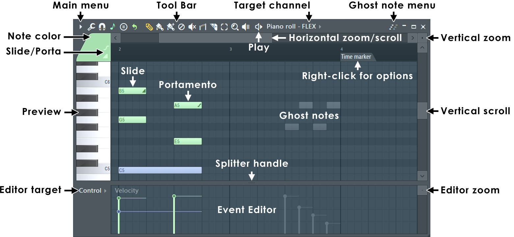
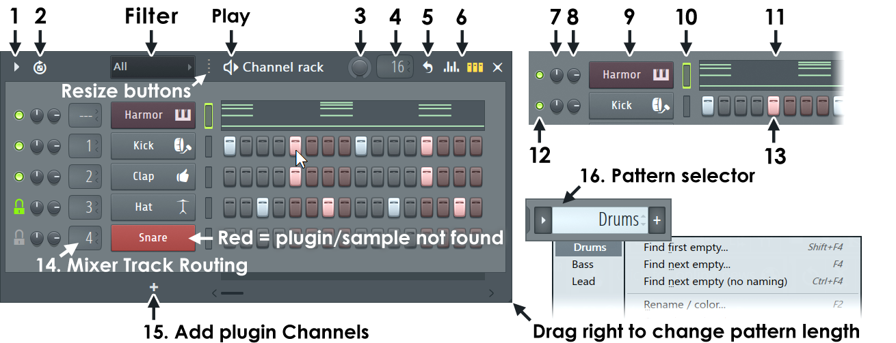

# Finally Moving Back To FL Studio
Back in 2018, without doing any research I bought my first MIDI (shout out to the [Novation Launchkey](https://us.novationmusic.com/launchkey), they're great for beginners) from Guitar Center.

The MIDI I picked was built with Ableton in mind, not [FL Studio](https://www.image-line.com/). I was fully on board when I learned the controller came with an Ableton download.

I do like Ableton, I have little to say about it in a negative light. For live jamming and recording I think it certainly has an edge on FL. With that being said, my initial music workflow comes from watching old YouTube videos, such as [Basshunter](https://en.wikipedia.org/wiki/Basshunter) teaching people how to [make catchy Eurodance loops.](https://www.youtube.com/watch?v=Yx0c6E1rAxg) It was always going to be an uphill battle using Ableton instead of FL.

I never used any other DAWs except these two. I hope someday I can try to compose some music in Pro Tools.

## Why Did I Switch?
I recently purchased a used [ThinkPad T14 Gen 3](https://www.lenovo.com/us/en/p/laptops/thinkpad/thinkpadt/thinkpad-t14-gen-3-(14-inch-intel)/len101t0014) from my local electronics recycler, [Comprenew](https://comprenew.org/). It also came equipped with a fresh install of Windows 11. This provided me an opportunity to re-evaluate my use of [Linux Mint](https://www.linuxmint.com/) on my [personal](/posts/linux-mint) laptop. 

I love Mint and despise Windows/Microsoft/Apple, but sometimes you have to compromise. I still use [CachyOS](https://cachyos.org/) on my gaming & development PC, [the PC I use](/posts/still-running-cachyos) to build this website.

### Ableton
This isn't meant to be a hit piece. Ableton is excellent software used by serious professionals, and for good reason. But if I'm being honest with myself, the **Session View** never clicked for me the way it does for producers who rely on it daily.

The clip-based workflow is powerful, but my brain doesn't think in clips. I think in patterns and loops that stack on top of each other. FL's Playlist view maps to that mental model naturally. It felt natural coming from video editing software. With Ableton, I always felt like I was one step removed from the actual music.

## What I Like About FL Studio
There is many different aspects of FL Studio I like. Before getting into technical reasons, I wanted to bring light to the other sides of FL and why I find it superior.

- The **pricing model** has long been the most generous among the major DAWs, with a one-time purchase granting you FL Studio for life! You also get all the updates and can upgrade further if you need more sounds/plugins. That's a fair trade-off to me.

- The [**online documentation**](https://www.image-line.com/fl-studio-learning/fl-studio-online-manual/html/basics_new_0.htm) is easy to read and covers literally everything you could need for using the software. It can't teach you music theory, but for me I don't need a ton of theory. My music relies heavily on concepts like [Tresillo](https://en.wikipedia.org/wiki/Tresillo_(rhythm)), which is far from rocket science. 

## What I Love About FL Studio
There is a lot to love about FL, but I will list my top 3.

- The stock **Plugins** within FL Studio Producer Edition are perfect for getting started making professional sounding music.

- The **UI** is intuitive. Coming back to it was like riding a bike. I find programming melodies to be easier than other DAWs, mainly due to the next point.

- FL Studio's **Piano Roll** and **Channel Rack** are simply the best for how I work. The channel rack allows me to perfect my drum patterns. As mentioned earlier with regards to melody programming, the piano rack shines.

> The excellent Piano Roll

> The Channel Rack simplifies drum patterns. If you want to learn all of the buttons, visit the [official FL Studio documentation.](https://www.image-line.com/fl-studio-learning/fl-studio-online-manual/html/channelrack.htm) 

## What's Next
Right now I'm just relearning the software and getting my sample library organized. It's a bit of a mess. 

Once that's squared away, I'm hoping to actually finish a track for the first time in a while. I've already produced two ideas last night.

## Conclusion
FL Studio is a phenomenal piece of software, I appreciate that a lot being a software developer myself. Don't get me wrong, the creators of Ableton, Pro Tools, etc. are all at an equal level of talent. 

When it comes to why FL beats the other guys, their business practices are the best while also providing an intuitive way to make music. I find the workflow in FL to be superior to Ableton. I can crank out melodies, drum patterns, and turn my ideas into music at a faster rate than ever.

### Bonus

> Simplified travel studio.