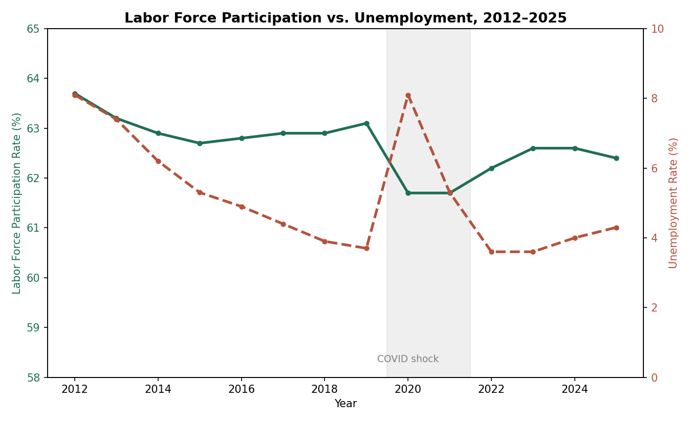

The last time I wrote anything under the Economics tag, it was a [research paper](/posts/making-nuclear-energy-competitve-with-fossil-fuels-and-natural-gas) for the [Nuclear Engineering](https://en.wikipedia.org/wiki/Nuclear_engineering) [department](https://en.wikipedia.org/wiki/University_of_Michigan_College_of_Engineering#Departments) at Michigan, arguing nuclear needs better subsidies to compete with fossil fuels and renewables. That paper leaned entirely on LCOE calculators and [IEA](https://en.wikipedia.org/wiki/International_Energy_Agency) [spreadsheets](https://en.wikipedia.org/wiki/Spreadsheet). This one's smaller in scope, but I found a table of civilian labor force data from the BLS going back to 2012, and instead of eyeballing it, I threw it into a `pandas.DataFrame` and let Python do the arithmetic I'd get wrong by hand.

## The Data

The table covers 2012 through 2025: total civilian [population](https://en.wikipedia.org/wiki/Population_(human_biology)), labor force size, participation rate, employment, unemployment, and how many people are outside the [labor force](https://en.wikipedia.org/wiki/Labor_force_in_the_United_States) entirely. One footnote before touching any of it: the 2025 figures are 11-month averages that exclude October, since data collection didn't happen that month because of the federal [government shutdown.](https://en.wikipedia.org/wiki/Government_shutdowns_in_the_United_States) So 2025 isn't strictly apples-to-apples with the other years, but it's close enough.

Here's the dataset and the first pass:

```python
import pandas as pd

data = {
    "year": [2012,2013,2014,2015,2016,2017,2018,2019,2020,2021,2022,2023,2024,2025],
    "population": [243284,245679,247947,250801,253538,255079,257791,259175,260329,261445,263973,266942,268571,273653],
    "labor_force": [154975,155389,155922,157130,159187,160320,162075,163539,160742,161204,164287,167116,168106,170807],
    "participation_rate": [63.7,63.2,62.9,62.7,62.8,62.9,62.9,63.1,61.7,61.7,62.2,62.6,62.6,62.4],
    "employed": [142469,143929,146305,148834,151436,153337,155761,157538,147795,152581,158291,161037,161346,163493],
    "unemployed": [12506,11460,9617,8296,7751,6982,6314,6001,12947,8623,5996,6080,6761,7314],
    "unemployment_rate": [8.1,7.4,6.2,5.3,4.9,4.4,3.9,3.7,8.1,5.3,3.6,3.6,4.0,4.3],
    "not_in_labor_force": [88310,90290,92025,93671,94351,94759,95716,95636,99587,100241,99686,99826,100465,102846],
}

df = pd.DataFrame(data).set_index("year")

# Year-over-year change in participation rate
df["participation_change"] = df["participation_rate"].diff()

# Employment growth rate
df["employment_growth_pct"] = df["employed"].pct_change() * 100

# "Not in labor force" as a share of the total population
df["nilf_share"] = df["not_in_labor_force"] / df["population"] * 100

print(df[["participation_rate", "unemployment_rate", "nilf_share"]])
```

That gives you the three numbers side by side:

```
      participation_rate  unemployment_rate  nilf_share
year
2012                63.7                8.1   36.299140
2013                63.2                7.4   36.751208
2014                62.9                6.2   37.114787
2015                62.7                5.3   37.348735
2016                62.8                4.9   37.213751
2017                62.9                4.4   37.148883
2018                62.9                3.9   37.129302
2019                63.1                3.7   36.900164
2020                61.7                8.1   38.254286
2021                61.7                5.3   38.341142
2022                62.2                3.6   37.763711
2023                62.6                3.6   37.396138
2024                62.6                4.0   37.407241
2025                62.4                4.3   37.582632
```

## What Jumps Out


> Two lines that are supposed to move together, and haven't, for six years straight. [Data source.](https://www.bls.gov/cps/data/aa2025/cpsa2025.pdf)

The [unemployment](https://en.wikipedia.org/wiki/Unemployment) story is the one everyone already knows: it climbs down steadily from 8.1% in 2012 to a low of 3.6% in 2022-2023, spikes hard to 8.1% in 2020, and by 2025 has crept back up to 4.3%.

The participation rate doesn't V-shape at all.

```python
covid_drop = df.loc[2020, "participation_rate"] - df.loc[2019, "participation_rate"]
print(f"2019->2020 participation rate drop: {covid_drop:.1f} points")

recovery_gap = df.loc[2019, "participation_rate"] - df.loc[2025, "participation_rate"]
print
```

```
2019->2020 participation rate drop: -1.4 points
Pre-covid vs 2025 participation gap: 0.7 points
```

Participation dropped 1.4 points from 2019 to 2020, which sounds small until you multiply it against a population pushing 260 million. Six years later, in 2025, the gap still hasn't closed. It's sitting 0.7 points below 2019, even though unemployment on paper looks almost back to normal.

Unemployment measures people actively looking for work and not finding it. It says nothing about people who just stopped looking. 

The `not_in_labor_force` column is where those people show up, and as a share of the population it jumped from 36.9% in 2019 to 38.3% in 2021, and has only partly come back down since, 37.6% in 2025.

Roughly a full percentage point of the population that used to be counted as in the labor force, working or looking, isn't anymore, and hasn't come back even as the headline unemployment number recovered.

## Why This Matters

Same lesson I kept running into on the nuclear paper: the number on the evening news is usually the one that flatters the story being told, and the more useful number is one column over.

Unemployment rate is a good number if you want to say the economy is fine now. Labor force participation is the number you'd want if you're trying to check whether that's actually true. 

A country can post a low unemployment rate while permanently carrying more people who've dropped out entirely: retired early, given up looking, gone on disability.

## The Code

The whole script is above, `pandas` is the only dependency. Swap in your own years or add columns from the BLS release, and the same `.diff()` / `.pct_change()` pattern gets you most of the way there without touching a spreadsheet.

---

Data source: U.S. Bureau of Labor Statistics, [Employment status of the civilian noninstitutional population, 1955 to date](https://www.bls.gov/cps/data/aa2025/cpsa2025.pdf) (Table 1, CPS Annual Averages, 2025). 2025 figures are 11-month averages excluding October due to the federal government shutdown.

Interested in the nuclear energy paper referenced above? [Read it here.](/posts/making-nuclear-energy-competitve-with-fossil-fuels-and-natural-gas)

Questions or corrections? Email me at [nickstambaugh@proton.me](mailto:nickstambaugh@proton.me)