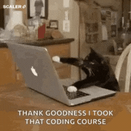

> This is a re-release from my original article on [Medium](https://medium.com/@nick-stambaugh/a-guide-to-the-umpire-method-7d233c5e1367)


# Introduction

How do you navigate an interview or Leetcode question when you get thrown a curveball?

It’s simple: The Umpire Method.

This methodology can show an interviewer your competent problem-solving skills, even if you end up getting the wrong result from your code.

# The Umpire Method: A Play-by-Play Guide

As developers, we’ve all been there. Staring at a coding problem, our minds racing with solutions, yet struggling to commit to an approach.

It’s a state of analysis paralysis, unable to take that crucial first step.

Enter the Umpire Method, a disciplined technique to help us cut through the noise.


## The Rules of Engagement

The Umpire Method follows a simple set of rules, designed to bring order to the problem-solving process.

Just as an umpire in baseball must make impartial decisions based on a strict interpretation of the rules, we too must adopt an unbiased approach to tackling challenges.

#### Umpire is mnemonic
U: Understand, M: Match, P: Plan, I: Implement, R: Review, E: Evaluate

## Rule 1: Understand the Problem 🌀

Before we can even consider a solution, we must first comprehend the problem at hand.

This involves carefully reading and re-reading the problem statement, ensuring that we grasp all the requirements and expected inputs/outputs.

Consider the following problem:

```python
# Implement a function that takes a list of integers and returns 
# the maximum sum of non-adjacent elements.

def max_sum_non_adjacent(nums):
    # Your solution goes here

```


> Thank you for the loans

Take the time to break down the problem into smaller pieces, and identify any edge cases or corner scenarios that need to be addressed.

Another suggestion would be to write pseudo-code in this step.

## Rule 2: Define Test Cases ☄️

With a solid understanding of the problem, we can now define a comprehensive set of test cases.

These test cases should cover edge cases to ensure that our eventual solution meets all the requirements.

Our goal here is to establish what we *WANT* from our function's output.

```python
# Test cases for max_sum_non_adjacent
test_cases = [
    ([1, 2, 3, 4], 6),      # Simple case
    ([], 0),                # Empty list
    ([5], 5),               # Single element
    ([3, 5, 2, 1, 7], 12),  # Non-adjacent elements
    # Add more...
]
```

By defining test cases upfront, we establish a clear set of goals and ensure that our solution is thoroughly validated.

## Rule 3: Develop a Brute Force Solution ⚡

With the problem well-defined and test cases in place, we can now tackle the actual solution.

However, instead of diving headfirst into algorithms, we start with a straightforward **brute force approach.**


This initial solution, while inefficient, serves as a baseline for future improvements and helps us validate our understanding.

```python
def max_sum_non_adjacent(nums):
    def solve(i):
        if i >= len(nums):
            return 0
        
        # Include the current element and skip the next
        include = nums[i] + solve(i + 2)
        
        # Exclude the current element
        exclude = solve(i + 1)
        
        return max(include, exclude)
    
    return solve(0)
```

By implementing a brute force solution, we gain valuable insights into the problem’s complexity.

## Rule 4: Optimize and Refine 🌌

We can now focus on optimizing and refining the function.

This is where we can apply our knowledge of algorithms, data structures, and problem-solving techniques to improve the elegance of our solution.

```python
def max_sum_non_adjacent(nums):
    # if the list is empty, the max sum is 0
    if not nums:
        return 0
    
    n = len(nums)
    # Initialize table with size n+1 to store max sums
    dp = [0] * (n + 1)
    
    # the max sum for a list of one element is that element itself
    dp[1] = nums[0]
    
    # Fill the table
    for i in range(2, n + 1):
        # The recurrence relation:
        # Either keep the previous max sum (dp[i-1]) 
        # OR add the current element (nums[i-1]) to the max sum of non-adjacent (dp[i-2])
        dp[i] = max(dp[i - 1], nums[i - 1] + dp[i - 2])
    
    # The last element in the table contains the result
    return dp[n]
```

In this example, we’ve applied dynamic programming to significantly improve the time complexity of our solution.

By leveraging patterns and relationships within the problem initially, we can arrive at a more efficient solution in the end.

## Rule 5: Validate and Reflect 💥

Finally, with our optimized solution in place, we must validate it against our predefined test cases.

If all test cases pass, we can confidently declare our solution as complete.

However, if any test cases fail, we must revisit our implementation.

```python
# Test the optimized solution
for test_case, expected_output in test_cases:
    result = max_sum_non_adjacent(test_case)
    print(f"Input: {test_case}, Expected Output: {expected_output}, Actual Output: {result}")
    assert result == expected_output
```


Once our solution is fully validated, it's essential to reflect on the process and document our learning.

##### What worked well?

##### What could have been done differently?

Capturing these insights will not only solidify our understanding but also better equip us for future coding challenges.

### Calling It Fair

The Umpire Method may seem like a simple approach, but its true power lies in its ability to bring discipline to the process.

By following these rules, we can overcome analysis paralysis, validate our understanding, and incrementally improve our code.